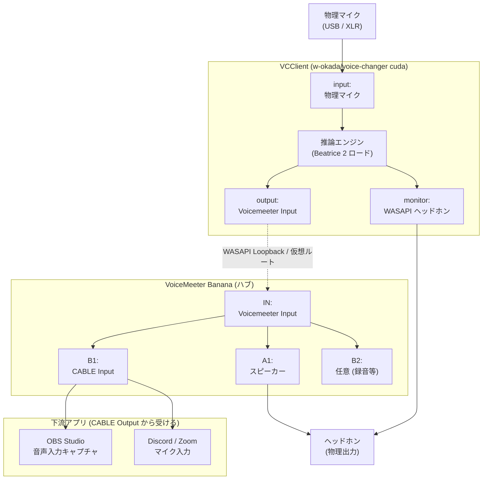
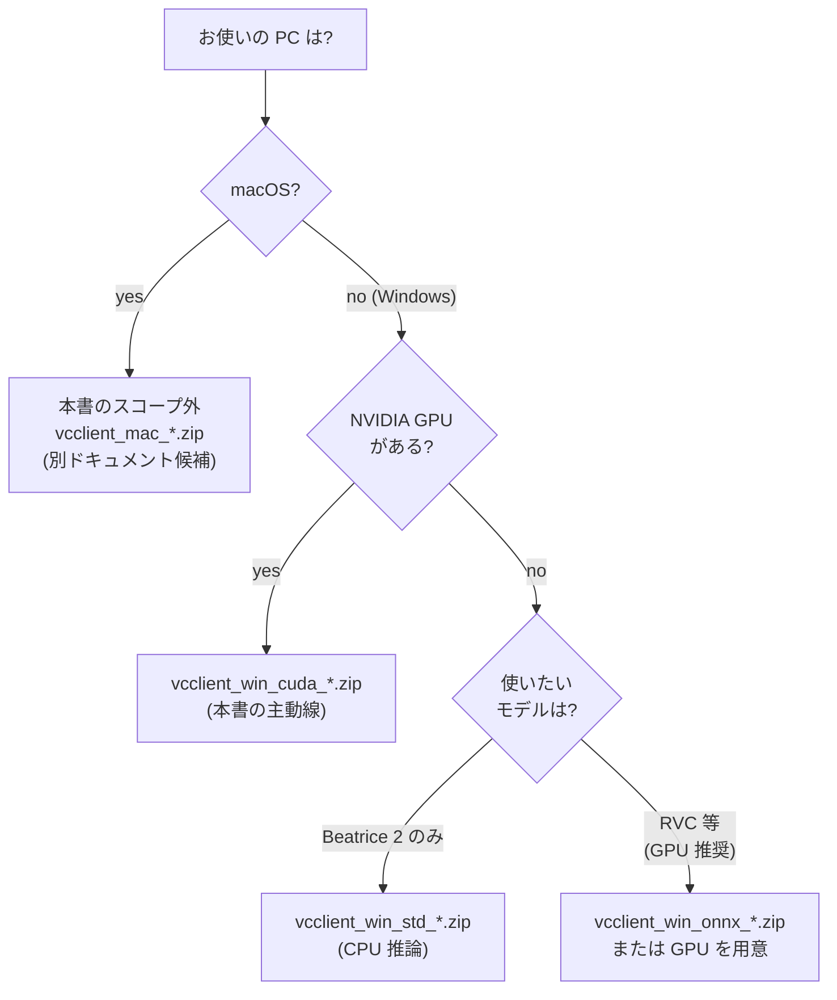
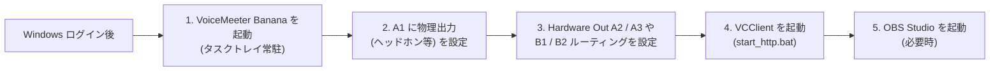
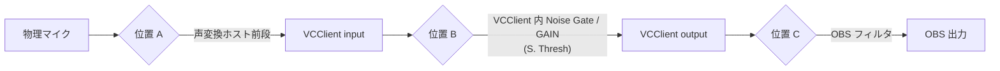
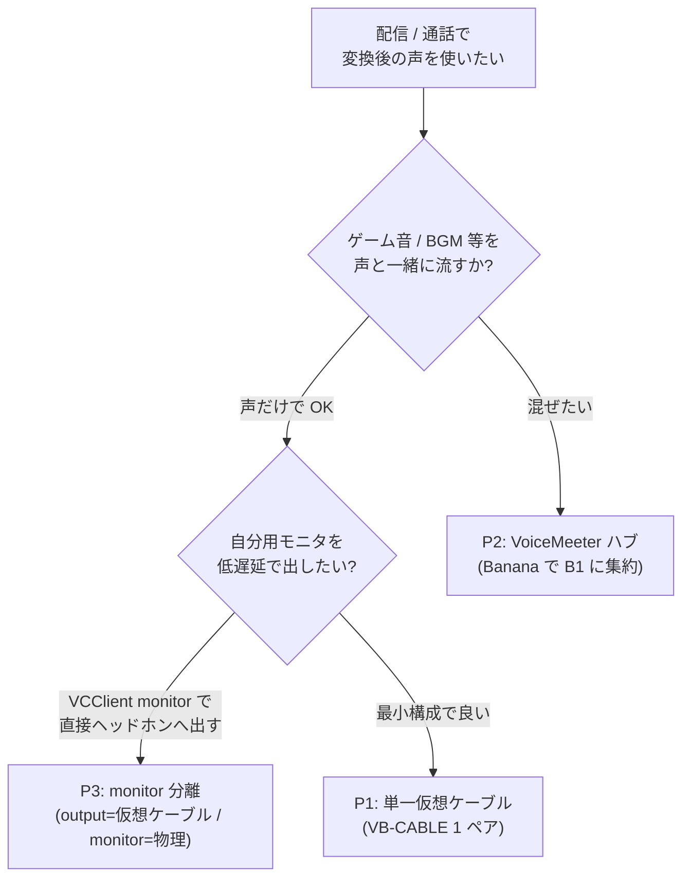
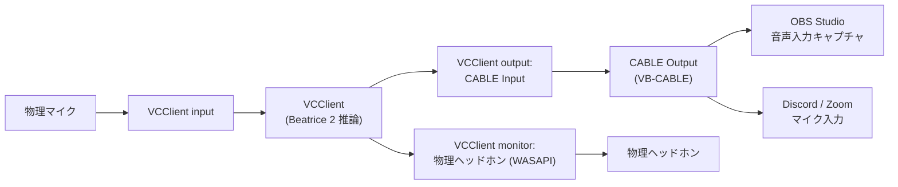
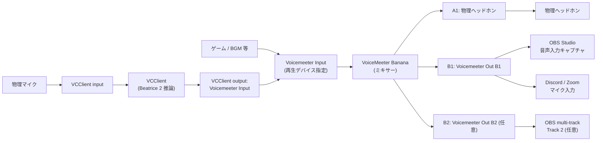
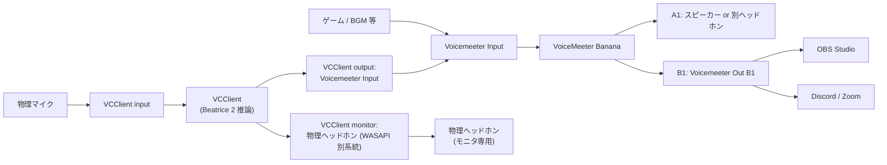

# VCClient + Beatrice + α インストールマニュアル（Windows 10/11）

> 本書は [vcclient-vs-beatrice.md §4 経路 B](./vcclient-vs-beatrice.md#4-3-つの使い方パターン同じ-beatrice-を使っても起動経路が違う)（**VCClient + Beatrice**）を **Windows 10/11 で配信用途に組む**ためのチュートリアル型ドキュメント。個別仕様の調査結果は既存 spec を参照し、本書は**手順の主動線**に徹する（spec の棚卸し / 比較表ではなく、上から順に読みながら作業できる操作手順ベース）。
>
> **進捗:** Phase 1 完了（範囲確定 + 公式情報源収集 + 目次最終化）。**Phase 2 完了**（§3〜§9 個別ツールのインストール手順記入。最終確認日 2026-05-14）。§10〜§14 の本文は Phase 3 で記入。プラン: [docs/plans/vcclient-beatrice-install-manual.md](../plans/vcclient-beatrice-install-manual.md)

## 1. 概要と前提

### 1.1 本書の位置付け

`docs/specs/` 配下の既存 spec は、

- リアルタイム声変換の**実行ホスト**としての [w-okada-voice-changer.md](./w-okada-voice-changer.md)（VCClient）
- 声変換**アルゴリズム / モデル**としての [beatrice.md](./beatrice.md)
- 両者の階層差を解きほぐす [vcclient-vs-beatrice.md](./vcclient-vs-beatrice.md)
- 配信経路の**仮想オーディオデバイス層**を棚卸しした [virtual-audio-devices.md](./virtual-audio-devices.md)
- 配信ソフト側の受け口を棚卸しした [obs-studio.md](./obs-studio.md)

までを**公式情報源ベースの棚卸し**として整備済み。一方で、これらを**実際に Windows PC 上で一連の手順として組み上げる**ためのドキュメントは存在しない。本書はそこを埋めるための、操作手順ベースのチュートリアル。

[docs/specs/README.md](./README.md) の 2.5 配信周辺ツール（シリーズ）配下に位置するが、シリーズの「複数ツール横断棚卸し」とは異なり、**経路 B（VCClient + Beatrice）に対象を絞った 1 本のセットアップ手順**である点で立て付けが異なる。

### 1.2 想定読者

- Windows 10 / 11（x64）の自宅 PC でリアルタイム声変換を**配信用途**で試したい人
- VCClient / Beatrice / 仮想オーディオデバイス / OBS のうち**少なくとも 1 つは未経験**で、何から手を付ければ良いか分からない状態
- 一般的な PC リテラシ（zip 展開・ドライバインストール・OBS の基本操作・Discord/Zoom の音声設定変更）はあることを前提
- 既存の個別 spec を参照することは厭わないが、**手順を上から順に追える主動線**を別途欲しい

### 1.3 対象 OS と対象エディション・バージョン

本書は以下の組み合わせを主動線として固定する。スコープから外したものは [§1.4](#14-本書のスコープ含めるもの--含めないもの) と被るので合わせて読む。

| レイヤ | 主動線 | 補助記述 | スコープ外 |
| --- | --- | --- | --- |
| **OS** | Windows 10 / 11（x64） | ARM64 Windows: 公式記述があれば触れる程度 | macOS / Linux（必要時に別ドキュメント化） |
| **VCClient エディション** | `vcclient_win_cuda_xxx.zip`（NVIDIA GPU 想定。[w-okada-voice-changer.md §2.4](./w-okada-voice-changer.md#24-配布形態とエディション)） | `vcclient_win_std_xxx.zip` / `vcclient_win_onnx_*.zip` への分岐は §3 で軽く言及 | `vcclient_mac_xxx.zip`（macOS 経路） |
| **Beatrice バージョン** | **Beatrice 2**（公式 VST 同梱モデル / 公式キャラクターエディション） | **Beatrice 1**（JVS Corpus Edition）は VCClient v.1 系での Windows 限定選択肢として位置付けと**営利目的禁止**条項のみ明示（[beatrice.md §5.4](./beatrice.md#54-beatrice-jvs-corpus-editionv1-系w-okadavoice-changer-経由)） | v1 / v2 のモデル形式は**非互換**（[beatrice.md §2.2](./beatrice.md#22-beatrice-1-と-beatrice-2-の差分)） |
| **仮想オーディオデバイス** | **VB-CABLE**（必須経路） + **VoiceMeeter Banana**（ハブ経路 / 推奨）。コア集合は [virtual-audio-devices.md §3](./virtual-audio-devices.md#3-各ツールエントリ) と同一 | **VoiceMeeter Potato** は Banana の上位として位置付けのみ言及 | macOS 系（BlackHole 等） |
| **配信ソフト** | **OBS Studio 32.1.x 系**（[obs-studio.md §1.2](./obs-studio.md#12-対象-obs-バージョン) の基準に合わせる） | — | Streamlabs Desktop / OBS.Live 等の派生版 |
| **ノイズ抑制 / ゲート** | OBS 内蔵 Noise Suppression（RNNoise / Speex / NVIDIA Audio Effects SDK 連携）と **NVIDIA Broadcast**（NVIDIA RTX 限定）を**選択肢として提示**し、公式入手元へのリンクを張る | — | 各プラグインの**選定軸比較**（配信周辺ツール調査シリーズ第 3 弾候補） |
| **通話アプリ** | **Discord** / **Zoom** の「マイク入力デバイスに VCClient output 系仮想デバイスを指定」「自動入力感度 / ノイズ抑制を OFF にする」レベルの汎用チェックリスト | — | アプリ固有の細かい挙動の網羅 spec 化 |

### 1.4 本書のスコープ（含めるもの / 含めないもの）

**含めるもの:**

- 経路 B（VCClient + Beatrice）を Windows で組む際の、**個別ツールごとのインストール手順**（§3〜§9）
- セットアップ完了時の音声経路を **Mermaid 図 1 枚**で示す（§2）
- [virtual-audio-devices.md §5 P1〜P4](./virtual-audio-devices.md#5-配信用途での典型構成) × [obs-studio.md §5](./obs-studio.md#5-配信用途での典型構成p1p4--obs-レシピ) の **Windows 配信用途レシピ**（P2 / P3 を主動線、§10）
- セットアップ後の段階的な**動作確認手順**（§11）
- 既知のハマりどころ早見表（§12）
- 配信収益化時に**読むべき規約**のチェックリスト（§13、[vcclient-vs-beatrice.md §6.3](./vcclient-vs-beatrice.md#63-ライセンスの所在に注意) 再掲）

**含めないもの:**

- 公式 VST 単体経路（経路 A）/ 派生クライアント経路（経路 C）の手順 — [vcclient-vs-beatrice.md §4](./vcclient-vs-beatrice.md#4-3-つの使い方パターン同じ-beatrice-を使っても起動経路が違う) で整理済み。本書は経路 B に絞る
- macOS / Linux 向け手順
- モデル**学習**ワークフロー（VCClient `trainer/` / Beatrice 公式トレーナー）
- モデル個別の音質評価 / レイテンシ実測値（[CLAUDE.md](../../CLAUDE.md) 方針）
- ノイズ抑制プラグインの**選定軸比較**（第 3 弾候補）
- 通話アプリ Discord / Zoom 固有の細かい挙動網羅
- 配信プラットフォーム側の規約解釈（YouTube / Twitch / niconico 等）
- 第三者の声を許諾なく再現するモデルの入手手順（[CLAUDE.md](../../CLAUDE.md) 方針）
- クラッキングされた配布物 / 非公式ミラー — 公式配布元（GitHub Releases / Hugging Face / 公式サイト / Microsoft Store 等）のみを参照

### 1.5 確認時のバージョン（バージョン pin）

本書執筆時に各ツール公式ページから読み取れた、本書が想定する**メジャー / マイナーバージョン**を以下に固定する。利用時点でこれらが古くなっている場合は、各章の「公式入手元」リンクから現行版を取得し、UI 表記の差分は本書の **最終確認日**（[§1.7](#17-最終確認日)）を起点に再確認する。

| ツール | バージョン基準 | 出典 |
| --- | --- | --- |
| **VCClient（w-okada/voice-changer）** | **v.2 系（`-beta` 付きで配布）**。本書執筆時点で Hugging Face [`wok000/vcclient000`](https://huggingface.co/wok000/vcclient000) リポジトリで配布されている `vcclient_win_cuda_*.zip` の最新を主動線とする | [w-okada-voice-changer.md §2.4](./w-okada-voice-changer.md#24-配布形態とエディション) / GitHub README "What's New!" |
| **Beatrice 2（公式 VST バイナリ）** | **2.0.0-rc.1**（[公式サイト](https://prj-beatrice.com) で本書執筆時点の最新表記） | [beatrice.md §1.2](./beatrice.md) |
| **Beatrice 1（v1 系）** | **Beatrice API 1.1.0 JVS Corpus Edition**（w-okada/voice-changer 同梱、Copyright 2023 Project Beatrice 表記）。本書ではバージョン位置付けと**営利目的禁止**条項の明示のみ | [beatrice.md §1.4](./beatrice.md#14-beatrice-1と-beatrice-2というバージョンの呼び方) |
| **OBS Studio** | **32.1.2**（2026-04-21 リリース） | [obs-studio.md §1.2 / §1.5](./obs-studio.md#12-対象-obs-バージョン) |
| **VB-CABLE** | 公式ページ [vb-audio.com/Cable/](https://vb-audio.com/Cable/) で配布されている現行 ZIP（具体バージョン番号は配布ページに記載なし。Reference Manual で「Windows 10/11 x64/Arm64、MME / WASAPI / KS、8 kHz〜192 kHz、最大 8 ch」と公称） | [virtual-audio-devices.md §3.1](./virtual-audio-devices.md#31-vb-cable) |
| **VoiceMeeter Banana** | **v2.1.1.8（2024-10）以降**（Windows 10/11 ARM64 対応版）を想定。新ドライバ以降は仮想出力デバイス名が `Voicemeeter Out B1 / B2` 形式で OS に露出 | [virtual-audio-devices.md §3.2](./virtual-audio-devices.md#32-voicemeeter-banana) |
| **NVIDIA Broadcast** | 公式 [NVIDIA Broadcast](https://www.nvidia.com/en-us/geforce/broadcasting/broadcast-app/) の現行版（NVIDIA RTX GPU 必須）。本書では入手元提示のみ | §8 |
| **Discord / Zoom** | バージョン不問。マイク入力デバイス選択と自動入力感度 / ノイズ抑制 OFF 程度のチェックリスト | §9 |

> **注意:** VCClient / Beatrice / OBS の各ツールはリリースが活発で、UI 表記・配布物名・推奨デフォルト値が随時変動する。本書の手順を踏む前に、**各章冒頭の公式入手元 URL に必ず一度アクセスし、現行版での配布物名と本書の記述に差分がないかを確認する**ことを推奨する。

### 1.6 操作手順の粒度（記述ルール）

本書 §3 以降の各操作手順は、原則として以下の 3 点を**文字で具体的に書く**形に揃える。スクリーンショットは本タスクでは添付しない（実機検証時に別途撮るかは後続タスクで判断）。

1. **クリック / 操作対象**: メニュー名・ボタン名・チェックボックス名を、各ツール公式ドキュメントが使っている表記そのままで書く（和訳 UI かどうかは公式記述がある場合のみ採用）
2. **期待される画面表記**: 操作後に画面のどこに何が出れば成功したと判断するか（ウィンドウタイトル / トーストメッセージ / デバイス一覧の項目名 等）
3. **次に進む条件**: 次の手順に進んでよい判定基準（例: 「Windows のサウンド設定 → 録音タブに `CABLE Output (VB-Audio Virtual Cable)` が表示される」「OBS の音声ミキサーに緑色のメーターが振れる」）

加えて、本書全体で以下の[CLAUDE.md](../../CLAUDE.md) 方針を遵守する。

- **公式ドキュメント / 公式 FAQ / 公式インストールガイドに書かれていること**と、コミュニティで一般に言われていることを明確に分け、出典を行ごとに明記する
- 実測値・断定的な性能評価は書かない。**ベンダー公称値は「ベンダー公称」として明示**し、本ラボでの実測値とは混ぜない
- ツール名・UI 表記は**各ツールの公式ドキュメントが使っている名称**をそのまま書く
- 第三者の声を許諾なく再現する用途には誘導しない。モデルやキャラクター音声の利用条件は**配布元の EULA を一次情報として読む**よう各章で明示する
- 図（音声経路）は **Mermaid**（` ```mermaid ` フェンスドコードブロック）で書き、ASCII 図は新規に書かない。subgraph タイトルに `<br/>` 改行は入れない
- 編集後は **vibeboard プレビュー**（`http://localhost:3010` 等）で Mermaid の表示崩れ・リンク切れを目視確認してから push する

### 1.7 最終確認日

- **本書 §1（範囲確定）最終確認日**: 2026-05-14
- **§3〜§9（Phase 2）最終確認日**: 2026-05-14（各章末尾の「公式情報源」節と本書 §3.x / §4.x / ... の冒頭の章別最終確認日と整合）
- **対象 OBS Studio バージョン**: 32.1.2（[obs-studio.md §1.5](./obs-studio.md#15-最終確認日) と整合）
- **対象 Beatrice 2 表記**: 2.0.0-rc.1（[beatrice.md §1.2](./beatrice.md) と整合）

§10 以降は Phase 3 で記入する。記入時には各章ごとに **その章の対象ツールの公式ページ最終確認日**を別途明記する（本書再訪時に章単位で再確認できるように）。

## 2. 完成図と前提

### 2.1 完成時の音声経路（Mermaid 図）

セットアップ完了時に、本書の主動線（経路 B / Windows / VCClient `cuda` エディション + Beatrice 2 + VB-CABLE + VoiceMeeter Banana + OBS Studio 32.1.x）で組み上がる音声経路は以下のとおり。



> **図の注釈:** 上図は本書 §10 で示す **P2（VoiceMeeter ハブ）/ P3（monitor 分離）寄り**の経路。仮想オーディオデバイスのコア集合・各経路パターンの位置付けは [virtual-audio-devices.md §5 P1〜P4](./virtual-audio-devices.md#5-配信用途での典型構成) を、OBS 側レシピは [obs-studio.md §5](./obs-studio.md#5-配信用途での典型構成p1p4--obs-レシピ) を参照（本書 §10 でこの 2 表を Windows 配信用途に絞った形で再掲）。
>
> 簡略経路（P1: VB-CABLE 単体 / VoiceMeeter なし）は §10 のレシピ表で別途示す。最初に試す構成として **P1（VB-CABLE 単体）** を採るか、最初から **P2（Banana ハブ）/ P3（monitor 分離）** を採るかは §10 の表で判断する。

### 2.2 ハードウェア・ソフトウェアの前提

| 項目 | 要件 | 出典 / 備考 |
| --- | --- | --- |
| OS | Windows 10 / 11（x64） | [§1.3](#13-対象-os-と対象エディション・バージョン) |
| GPU | NVIDIA GPU（CUDA 対応）。`vcclient_win_cuda_*.zip` を使う場合 | [w-okada-voice-changer.md §2.4](./w-okada-voice-changer.md#24-配布形態とエディション)。CPU のみの環境では `vcclient_win_std_*.zip` / `vcclient_win_onnx_*.zip` への分岐を §3 で示す |
| ブラウザ | **Google Chrome**（VCClient UI 表示用） | VCClient 公式 RVC チュートリアル `tutorials/tutorial_rvc_ja_latest.md` で「ブラウザ（Chrome のみサポート）」と明記（[w-okada-voice-changer.md §2.3](./w-okada-voice-changer.md#23-起動形態--ui)） |
| ヘッドホン | 自分用モニタ用（ハウリング防止のため有線推奨） | 一般論。VCClient `monitor` デバイスに別出力を割り当てるとループを切れる（[w-okada-voice-changer.md §5.2](./w-okada-voice-changer.md#52-input--output--monitor-の-3-デバイス構成server-device-modev1537)） |
| マイク | 任意（USB マイク / オーディオインターフェース経由の XLR マイク） | — |
| ディスク空き | 数 GB 程度（VCClient zip 展開 + Beatrice モデル + OBS インストール先で目安 5〜10 GB） | 各ツール公式に明示の合計値は無し。本書では目安値として記載（**未確認**扱いで強い断定はしない） |

### 2.3 公式入手元 URL 一覧

§3 以降の各章で参照する**公式ダウンロード URL / 公式インストールガイド / 公式ライセンスページ / 公式 FAQ / Known Issues** を、ここで一度まとめる。本書を再訪したときに、各章を読み込まなくても入手元だけ追えるようにするのが目的。

| ツール | 公式ダウンロード | 公式ガイド / マニュアル | ライセンス / 規約 | FAQ / Known Issues |
| --- | --- | --- | --- | --- |
| **VCClient** | Hugging Face: <https://huggingface.co/wok000/vcclient000> | GitHub README + `tutorials/`: <https://github.com/w-okada/voice-changer> | リポジトリ本体: **MIT License**（[w-okada-voice-changer.md §7](./w-okada-voice-changer.md#7-ライセンス--配布物の利用条件と本ラボで扱う際の注意点)） | GitHub Issues: <https://github.com/w-okada/voice-changer/issues> / Discussions: <https://github.com/w-okada/voice-changer/discussions> |
| **Beatrice 2（公式 VST 本体）** | <https://prj-beatrice.com>（公式サイトからダウンロード） | 公式 VST ソース README: <https://github.com/prj-beatrice/beatrice-vst>（配布告知レベル） / 技術仕様はトレーナー側 <https://huggingface.co/fierce-cats/beatrice-trainer> に集約 | **VST 本体 EULA**: 公式サイト記述（統合 EULA の所在は本ラボでは **未確認**、[beatrice.md §5.1](./beatrice.md#51-公式-vst-本体バイナリ配布)） / VST ソース・トレーナー: **MIT License**（[beatrice.md §5](./beatrice.md#5-配布形態とライセンス)） | 公式サイト Q&A セクション（<https://prj-beatrice.com>） |
| **Beatrice 2 キャラクターエディション**（つくよみちゃん / 刻鳴時雨 / OLUNE） | 公式サイト [prj-beatrice.com](https://prj-beatrice.com) / 公式モデル配布リスト Notion: <https://prj-beatrice.notion.site/246fb3c9fba480119c95ec07e205f061> | キャラクターエディション個別ページ（公式サイトからリンク） | **個別 EULA**（つくよみちゃん / 刻鳴時雨 / OLUNE で別々）。[beatrice.md §5.3](./beatrice.md#53-公式キャラクターエディション公式サイト配布) | 配布元ページの注意書きを各エディション個別に参照 |
| **Beatrice 1（JVS Corpus Edition）** | w-okada/voice-changer リポジトリ経由: <https://github.com/w-okada/voice-changer/blob/master/server/voice_changer/Beatrice/> | 同上 README | **営利目的禁止**（JVS Corpus 規約準拠）。[beatrice.md §5.4](./beatrice.md#54-beatrice-jvs-corpus-editionv1-系w-okadavoice-changer-経由) | — |
| **VB-CABLE** | <https://vb-audio.com/Cable/> | Reference Manual PDF: <https://vb-audio.com/Cable/VBCABLE_ReferenceManual.pdf> / 同系列追加ケーブル: <https://vb-audio.com/Cable/VirtualCables.htm> | **Donationware** / VB-Audio ライセンス: <https://vb-audio.com/Services/licensing.htm> / Donationware モデル説明: <https://vb-audio.com/Voicemeeter/Donationware.htm>。商用配信での利用可否は公式 EULA 原文を本ラボで未裏取り（[virtual-audio-devices.md §3.1](./virtual-audio-devices.md#31-vb-cable) 未確認事項） | 公式集約 FAQ ページは本ラボで特定できず、ハマりどころは forum.vb-audio.com に分散（[virtual-audio-devices.md §3.1](./virtual-audio-devices.md#31-vb-cable)） |
| **VoiceMeeter Banana** | <https://vb-audio.com/Voicemeeter/banana.htm> / ファミリー一覧: <https://vb-audio.com/Voicemeeter/> | User Manual PDF: <https://vb-audio.com/Voicemeeter/VoicemeeterBanana_UserManual.pdf> / ARM64 プレスリリース（2024-10）: <https://vb-audio.com/archive/Blog/VBAudioPressRelease_Oct2024.htm> | **Donationware** / VB-Audio ライセンス（VB-CABLE と同一ページ） | <https://forum.vb-audio.com>（公式フォーラム） |
| **OBS Studio** | <https://obsproject.com/> / <https://obsproject.com/download> | Help ポータル: <https://obsproject.com/help> / Knowledge Base: <https://obsproject.com/kb/> / KB Audio カテゴリ: <https://obsproject.com/kb/category/7> / GitHub Wiki: <https://github.com/obsproject/obs-studio/wiki> | **GPL-2.0**（[obs-studio.md §1 / §3](./obs-studio.md)） | Forum: <https://obsproject.com/forum/> / GitHub Issues: <https://github.com/obsproject/obs-studio/issues> |
| **NVIDIA Broadcast** | <https://www.nvidia.com/en-us/geforce/broadcasting/broadcast-app/> | 同ページ "Documentation" セクション | NVIDIA Broadcast EULA（インストーラ同梱 / 公式ページ記載）。NVIDIA RTX GPU 必須 | NVIDIA フォーラム: <https://forums.developer.nvidia.com/c/audio-and-video-technologies/nvidia-broadcast> |
| **Discord** | <https://discord.com/download> | 公式ヘルプ: <https://support.discord.com/> | Discord 利用規約 | <https://support.discord.com/hc/en-us/categories/200404398> |
| **Zoom** | <https://zoom.us/download> | 公式サポート: <https://support.zoom.com/hc/en> | Zoom 利用規約 | 公式サポートの「音声」カテゴリ |

> **重要:** 上表のリンクは Phase 1 時点で本ラボの既存 spec から確認できた公式 URL を集約したもの。**Phase 2 で各章の手順を書く際は、これらの公式ページを再度開いて当時の UI 表記と現行版に差分がないかを確認する**。差分があった場合は本書 §1.7 の最終確認日を更新し、章単位の確認日も併記する。

## 3. VCClient のインストール

> **対象読者:** Windows 10/11 (x64) で初めて VCClient をセットアップする人。**本書の主動線は `vcclient_win_cuda_*.zip`**（NVIDIA GPU 想定。Beatrice 2 自体は公式サイト記述で「CPU シングルスレッド動作」と謳われているため [beatrice.md §2.3](./beatrice.md#23-入出力と動作モデルの位置関係公式-vst-としての形)、Beatrice 2 を主目的にする場合は `std` 系で十分動く可能性がある — その場合の分岐は [§3.1](#31-エディション選択フロー) で示す）。
>
> **§3 最終確認日:** 2026-05-14

### 3.1 エディション選択フロー

Hugging Face [`wok000/vcclient000`](https://huggingface.co/wok000/vcclient000) には `vcclient_win_cuda_*.zip` / `vcclient_win_std_*.zip` / `vcclient_win_onnx_*.zip` / `vcclient_mac_*.zip` が並んでおり（[w-okada-voice-changer.md §2.4](./w-okada-voice-changer.md#24-配布形態とエディション)）、まず以下で 1 つに絞る。



- **`vcclient_win_cuda_*.zip` を選ぶ判断軸**: ロードする可能性があるモデルに RVC 系 / Beatrice 以外の SVC 系（MMVC / so-vits-svc / DDSP-SVC）が含まれる場合は GPU が事実上前提（[w-okada-voice-changer.md §8 必要 GPU 性能](./w-okada-voice-changer.md#8-voice-changer-types-4-評価軸への暫定マッピング)）。本書の主動線。
- **`vcclient_win_std_*.zip` を選ぶ判断軸**: NVIDIA GPU が無い、または **Beatrice 2 専用で使いたい**場合（Beatrice 2 公式サイトに「CPU シングルスレッド動作」とあり、推論に GPU を要求しないと明記。[beatrice.md §2.3](./beatrice.md#23-入出力と動作モデルの位置関係公式-vst-としての形)）。
- **`vcclient_win_onnx_*.zip` を選ぶ判断軸**: README に存在は確認できているが用途は公式に明示されておらず（**未確認**、[w-okada-voice-changer.md §2.4](./w-okada-voice-changer.md#24-配布形態とエディション)）、ONNX Runtime 経由の実行用と推測される程度。本書では選択肢列挙のみで深追いしない。

### 3.2 公式入手元

- **配布元（Hugging Face）**: <https://huggingface.co/wok000/vcclient000>
- **リポジトリ（README / `tutorials/`）**: <https://github.com/w-okada/voice-changer>
- **ライセンス**: MIT（リポジトリ直下 `LICENSE`。[w-okada-voice-changer.md §7.1](./w-okada-voice-changer.md#71-リポジトリ本体)）

### 3.3 ダウンロード手順

1. ブラウザで Hugging Face リポジトリ <https://huggingface.co/wok000/vcclient000> を開く。
2. 「Files and versions」タブを表示し、**ファイル一覧の中から本書の主動線 `vcclient_win_cuda_*.zip`** を探す（バージョン番号部分（`*`）には [§1.5](#15-確認時のバージョンバージョン-pin) で示した v.2 系 `-beta` 付きの最新が入る）。
3. ファイル名の右側にある **下矢印（ダウンロード）アイコン**をクリックしてダウンロードを開始する。
   - **期待される挙動**: ブラウザのダウンロードに `.zip` ファイルが現れる。Hugging Face はファイルサイズが大きい場合 LFS 経由になるため、ダウンロード途中で中断すると整合性が崩れる場合がある（**コミュニティ言及**、Hugging Face Hub 一般）。
4. **次に進む条件**: zip ファイルがダウンロード完了し、ファイルマネージャからサイズが表示されること。
5. **チェックサム / 署名検証の公式手順**は本書確認時点では **未確認**（Hugging Face リポジトリ側にハッシュ表記の慣習はあるが、各リリースごとの記載有無は本書では裏取りしていない）。

### 3.4 展開先の選び方

1. ダウンロードした `vcclient_win_cuda_*.zip` を右クリック → **「すべて展開」** または 7-Zip / Explzh などの展開ツールで展開する。
2. 展開先のパスについての**公式の明示記述**は本書確認時点では未確認（**未確認事項**として [§3.10](#310-未確認事項--§3-時点) に残す）。コミュニティで一般に言われる点として、以下は本書では**コミュニティ言及**扱いで提示する。
   - **パスに日本語・空白・全角文字を含めない**（コミュニティ言及。Python / PyTorch 系の依存があるため一般則として推奨される）。
   - **「Program Files」直下を避ける**（UAC の影響でログ / 設定ファイルが書き込めない事例が報告されている。コミュニティ言及）。
   - 推奨配置例: `C:\vcclient\vcclient_win_cuda_<バージョン>\`（コミュニティ言及）。
3. **展開後の主なファイル**: ルート直下に `start_http.bat`（起動スクリプト。ファイル名は配布バージョンにより `MMVCServerSIO.bat` 等の名前で出る場合あり — **未確認、配布物展開後に実物を確認する**）と、`MMVCServerSIO.exe` / `python_xxx/` などの実行ランタイム一式が並ぶ構成（**未確認**、配布物のディレクトリ構造は本書で裏取りしておらず、初回展開時に目視確認する想定）。
4. **次に進む条件**: 展開先フォルダのルートに `.bat` ファイルが 1 つ以上存在することを目視確認できる状態。

### 3.5 Windows Defender / SmartScreen の挙動

VCClient は **公式署名証明書付き配布ではない**（**未確認**だが、Hugging Face で署名ありの zip を配る慣習は一般的でない）。そのため初回起動時に以下のいずれかが発火する可能性がある。

- **Microsoft Defender SmartScreen**: 「WindowsによってPCが保護されました」ダイアログ。
  - **対処**: ダイアログの **「詳細情報」** をクリック → 下部に現れる **「実行」** ボタンを押す。
  - **期待される挙動**: ダイアログが閉じ、次の手順（PowerShell コンソール / コマンドプロンプトの起動）に進む。
- **Microsoft Defender ウイルススキャン**: zip 展開時 / `.exe` 実行時にスキャンが入り、誤検知でファイルが隔離される可能性（**コミュニティ言及**、PyInstaller 系の Python アプリで散見される一般傾向）。
  - **対処**: Windows セキュリティ → ウイルスと脅威の防止 → 設定 → 除外の追加 で、**VCClient の展開フォルダ全体**を除外に追加。
  - **注意**: 除外を追加するということは、そのフォルダ内のファイルがマルウェアであっても検知されないということ。**配布元（Hugging Face 公式リポジトリ）以外から取得した zip を除外に入れない**こと。

### 3.6 初回起動と Chrome 起動の確認

1. 展開先フォルダの **`start_http.bat`**（または配布物に含まれる起動用 `.bat`）をダブルクリックで起動する。
   - **期待される画面表記**: コマンドプロンプト / PowerShell のような黒いコンソールウィンドウが開き、Python ランタイムの起動ログが流れる。最後に `http://127.0.0.1:<ポート番号>/` のような URL が表示される（**ポート番号は配布物 / バージョンによって変動 — 起動時のログを目視確認**）。
2. **Chrome を起動**して、ログに表示された URL（例: `http://127.0.0.1:18888/`）をアドレスバーに貼り付ける。
   - **重要: ブラウザは Chrome のみサポート**（[w-okada-voice-changer.md §2.3](./w-okada-voice-changer.md#23-起動形態--ui)。公式 RVC チュートリアル `tutorials/tutorial_rvc_ja_latest.md` で「ブラウザ（Chrome のみサポート）」と明記）。Edge / Firefox / Safari で開いても UI が正しく表示されない可能性があり、トラブル時の問い合わせ先（公式 Issues / Discussions）でも「Chrome を使ってください」と案内される。
3. **期待される画面表記**: VCClient の UI（モデル選択エリア / input・output・monitor のデバイス選択 / GAIN / TUNE / CHUNK / EXTRA 等のスライダー）が表示される。
4. **次に進む条件**: 上記 UI 全体がエラー無くレンダリングされること。コンソールウィンドウは**起動中は閉じない**（閉じるとサーバプロセスが落ちて UI も切れる）。

### 3.7 モデルスロット UI の位置確認

VCClient の UI には **モデルスロット**と呼ばれる**モデル選択エリア**が存在する（[w-okada-voice-changer.md §3.2](./w-okada-voice-changer.md#32-ホストとモデルの責任分界暫定整理)。RVC チュートリアル `tutorials/tutorial_rvc_ja_latest.md` で「モデル選択エリアから使いたいモデルをクリック」「編集ボタンを押すと、モデル一覧（モデルスロット）を編集することができます」と明記）。

1. UI 上部または左ペイン（**配布バージョンにより配置位置が変動 — 公式チュートリアル `tutorials/tutorial_rvc_ja_latest.md` の最新版を参照**）の **モデル選択エリア**を確認する。
2. **編集ボタン（鉛筆アイコンまたは「編集」テキスト）**をクリックして、モデルスロット編集画面に入れることを確認する。
3. **次に進む条件**: モデルスロット編集画面が開き、空のスロットが並んでいる状態（初回起動直後はモデル未ロードのため空）。
4. ここで一旦止めて、[§4](#4-beatrice-モデルの入手と-vcclient-へのロード) に進む。

### 3.8 終了手順

- ブラウザの UI タブを閉じても、**コンソールウィンドウ側のサーバプロセスは生きたまま**（Chrome タブを再度開けば UI が戻る）。
- 完全に終了したい場合は、起動時に開いた**コンソールウィンドウを閉じる**（または `Ctrl+C` でサーバを停止）。
- **モデルスロットの編集内容（モデルファイルの追加 / 並び順 / メタ情報）はサーバ側で保存される**（**未確認**、保存先パスは本書で裏取りしていない）。

### 3.9 既知の制約 / 注意点（§3 範囲）

- **Chrome 限定の UI** ([§3.6](#36-初回起動と-chrome-起動の確認))。
- **公式署名証明書なし** ([§3.5](#35-windows-defender--smartscreen-の挙動))。SmartScreen / Defender の除外対応はユーザ責任で判断する。
- **配布物の zip 展開先パスの公式記述は未確認** ([§3.4](#34-展開先の選び方))。
- **CUDA を認識しない / GPU を認識しない場合のトラブルシュート**は [§12 既知のハマりどころ早見表](#12-既知のハマりどころ早見表) で扱う（Phase 3 で記入）。

### 3.10 未確認事項（§3 時点）

- 展開先パスに関する公式記述（日本語パス / 空白 / Program Files 等の許容範囲）
- 配布バージョンごとの起動スクリプト名（`start_http.bat` / `MMVCServerSIO.bat` 等の表記揺れ）
- `vcclient_win_onnx_*.zip` の用途と要件
- 配布物のチェックサム / 署名検証の公式手順
- モデルスロット編集画面のレイアウトのバージョン間差分
- モデルスロットの保存ファイルパス

### 3.11 公式情報源（§3 で参照）

- Hugging Face 配布元: <https://huggingface.co/wok000/vcclient000>
- GitHub リポジトリ: <https://github.com/w-okada/voice-changer>
- 公式 RVC チュートリアル（Chrome 限定の言及 / モデルスロット記述）: `tutorials/tutorial_rvc_ja_latest.md`（[w-okada-voice-changer.md §2.3](./w-okada-voice-changer.md#23-起動形態--ui) / [§3.2](./w-okada-voice-changer.md#32-ホストとモデルの責任分界暫定整理)）
- 公式 Device mode チュートリアル: `tutorials/tutorial_device_mode_ja.md`（[w-okada-voice-changer.md §2.2](./w-okada-voice-changer.md#22-入力--出力の制御モードdevice-mode)）

## 4. Beatrice モデルの入手と VCClient へのロード

> **対象読者:** [§3](#3-vcclient-のインストール) を完了し、VCClient の UI（モデルスロット）が表示されている状態の人。本書の主動線は **Beatrice 2 公式モデル**（v.2 系 VCClient + Beatrice 2 paraphernalia）。Beatrice 1（JVS Corpus Edition）は [§4.4](#44-beatrice-1jvs-corpus-edition-v1-系の選択肢と営利目的禁止条項) で**位置付けと営利目的禁止条項のみ明示**し、本書では主動線にしない。
>
> **§4 最終確認日:** 2026-05-14
>
> **重要な前提（[beatrice.md §1.4](./beatrice.md#14-beatrice-1と-beatrice-2というバージョンの呼び方) より）:**
>
> - **Beatrice 1 と Beatrice 2 のモデル形式は非互換**（[beatrice.md §2.2](./beatrice.md#22-beatrice-1-と-beatrice-2-の差分)。公式トレーナー README に「新しい Trainer で生成したモデルは、古いバージョンの公式 VST、VCClient、beatrice-client で動作しません」と明記）。
> - **v.2 系 VCClient は Beatrice 2 のみ**、**v.1 系 VCClient は Beatrice 1 のみ**サポート（[w-okada-voice-changer.md §3.1](./w-okada-voice-changer.md#31-v2-と-v1-のサポートモデル差分readme-表より) の README サポート表）。
> - 本書の主動線は **v.2 系 + Beatrice 2**（[§1.3](#13-対象-os-と対象エディション・バージョン)）。

### 4.1 Beatrice モデルの 4 つの入手先

[beatrice.md §5](./beatrice.md#5-配布形態とライセンス) の整理を本書のインストール手順視点で並べ直す。**本書で扱う Beatrice 2 のモデル入手先は 3 つ**（+ v1 のみ別系統で 1 つ）。

| 入手元 | 主な配布物 | ライセンス所在 | 本書での扱い |
| --- | --- | --- | --- |
| **公式 VST バイナリ同梱モデル** | Beatrice 2 公式 VST 本体に含まれる（[beatrice.md §5.1](./beatrice.md#51-公式-vst-本体バイナリ配布)） | 公式サイト記述（**統合 EULA の所在は未確認** [beatrice.md §5.1](./beatrice.md#51-公式-vst-本体バイナリ配布)） | 本書経路 B では **VCClient から呼ぶ**ため、VST バイナリ自体は使わない。**VST 単体経路（経路 A）は [vcclient-vs-beatrice.md §4](./vcclient-vs-beatrice.md#4-3-つの使い方パターン同じ-beatrice-を使っても起動経路が違う) と別タスク**（[§14](#14-後続タスク)） |
| **公式キャラクターエディション** | つくよみちゃん / 刻鳴時雨 / OLUNE（公式サイト配布） | エディションごとの **個別 EULA**（[beatrice.md §5.3](./beatrice.md#53-公式キャラクターエディション公式サイト配布)） | 本書 [§4.3](#43-キャラクターエディションつくよみちゃん--刻鳴時雨--olune-の入手手順) で入手手順を示す |
| **公式モデル配布リスト（Notion）** | コミュニティ / 公式の Beatrice 2 paraphernalia 一覧 | リスト先の各ページに従う（[beatrice.md §5.3](./beatrice.md#53-公式キャラクターエディション公式サイト配布)） | 本書 [§4.2](#42-beatrice-2-公式モデルの入手手順-vst-バイナリ同梱-モデル配布リスト) で位置のみ案内 |
| **w-okada/voice-changer 同梱（v1 のみ）** | Beatrice API 1.1.0 JVS Corpus Edition（[beatrice.md §5.4](./beatrice.md#54-beatrice-jvs-corpus-editionv1-系w-okadavoice-changer-経由)） | **営利目的禁止**（JVS Corpus 規約準拠） | [§4.4](#44-beatrice-1jvs-corpus-edition-v1-系の選択肢と営利目的禁止条項) で位置付けと条項のみ明示。**本書の主動線ではない** |

### 4.2 Beatrice 2 公式モデルの入手手順（VST バイナリ同梱 / モデル配布リスト）

「キャラクター入りでないシンプルな話者モデル」または「公式 VST バンドルに含まれる素のモデル」を試したい場合は以下。

1. ブラウザで公式サイト <https://prj-beatrice.com> を開く。
2. **「Beatrice 2 公式 VST」のダウンロードリンク**を探す。本書執筆時点の最新表記は **2.0.0-rc.1**（[§1.5](#15-確認時のバージョンバージョン-pin)）。
3. **公式モデル配布リスト**へのリンクを公式サイト内から辿る（「モデル配布リスト (試験運用)」表記でリンクされている — [beatrice.md §5.3](./beatrice.md#53-公式キャラクターエディション公式サイト配布)）。
   - **配布リスト URL**: <https://prj-beatrice.notion.site/246fb3c9fba480119c95ec07e205f061>
   - **期待される画面表記**: Notion ページに Beatrice 2 paraphernalia のリストが並ぶ。
4. 各モデルの **個別ページ**を開き、**ライセンス / 利用条件**を確認したうえでダウンロードする。
   - **注意**: 「Beatrice 公式配布リストに載っているから自由に使える」とは限らない。**各モデル個別のページ記述を一次情報として読む**（[beatrice.md §5.6](./beatrice.md#56-配布形態とライセンスのレイヤ整理まとめ) 運用ルール）。
5. **次に進む条件**: ローカルディスクに Beatrice 2 形式の paraphernalia（モデルファイル群が入ったディレクトリ、または zip）が存在し、その配布元の利用条件を確認済みであること。

### 4.3 キャラクターエディション（つくよみちゃん / 刻鳴時雨 / OLUNE）の入手手順

公式サイトで配布されている **キャラクター入り Beatrice 2 エディション**は本書執筆時点で 3 種類（[beatrice.md §5.3](./beatrice.md#53-公式キャラクターエディション公式サイト配布)）:

- つくよみちゃんエディション
- 刻鳴時雨エディション
- OLUNE エディション

**個別 EULA の確認は本書では絶対省略しない**。以下は手順のテンプレ。各エディションで踏み方は同じ。

1. ブラウザで公式サイト <https://prj-beatrice.com> を開く。
2. 各エディションのページ（公式サイトトップからリンク）を開く。
3. **「使用許諾・ダウンロード」ページに進む**。
   - **期待される画面表記**: 各エディション専用の **EULA（使用許諾契約書）本文**が表示される。
4. **EULA 本文を一次情報として読む**。本書では EULA 本文の引用 / 要約は行わない（[CLAUDE.md](../../CLAUDE.md) 方針）。最低限以下のチェックリストを自分でつぶす:
   - [ ] **商用利用の可否**（配信で広告収益・スポンサー案件・有償配信を伴う場合）
   - [ ] **配信時のクレジット表記要件**（配信タイトル・配信画面・配信概要のどこに / 何を書くか）
   - [ ] **二次配布 / 再頒布の可否**（モデルファイル自体を他人に渡す行為）
   - [ ] **モデルを改変して使う場合の条件**（学習素材として転用、または paraphernalia 形式から派生物を作る場合）
   - [ ] **キャラクターのなりすまし利用 / 第三者を装う用途の禁止規定**
5. EULA に同意できる場合のみ、**「同意してダウンロード」ボタン**等を押下してモデルをダウンロードする。
   - **次に進む条件**: ローカルディスクに Beatrice 2 形式のエディションファイル一式が存在し、EULA 本文を確認・同意済みであること。
6. **配信開始前にもう一度 EULA を見直す**ことを推奨する（バージョン更新で条件が変わる場合がある）。

> **本書では EULA 本文の具体的な解釈は書かない**。理由: EULA は配布元の改訂で内容が変わる + 法的判断はユーザの責任 ([CLAUDE.md](../../CLAUDE.md) 方針)。**「Beatrice 公式が出しているから自由に使える」と読み取らない**（[beatrice.md §5.3](./beatrice.md#53-公式キャラクターエディション公式サイト配布)）。

### 4.4 Beatrice 1（JVS Corpus Edition v1 系）の選択肢と営利目的禁止条項

> **本書の主動線ではない。** 配信で収益化する人は **使わない**、または **権利者の事前許諾を取る**ことを前提に判断する。

[w-okada-voice-changer.md §3.1](./w-okada-voice-changer.md#31-v2-と-v1-のサポートモデル差分readme-表より) の README サポート表で「Beatrice v1 は Windows のみ」と書かれているのは、**v.1 系 VCClient + Beatrice API 1.1.0 JVS Corpus Edition**（w-okada/voice-changer リポジトリ同梱 README、Copyright 2023 Project Beatrice 表記）を指す（[beatrice.md §5.4](./beatrice.md#54-beatrice-jvs-corpus-editionv1-系w-okadavoice-changer-経由)）。

w-okada リポジトリ同梱 README の主な記載（[beatrice.md §5.4](./beatrice.md#54-beatrice-jvs-corpus-editionv1-系w-okadavoice-changer-経由) 引用）:

- 表題: **Beatrice API (1.1.0 JVS Corpus Edition)**
- 著作権表示: **Copyright 2023 Project Beatrice**
- **利用制限（公式の文言）**:
  > **「営利目的の使用を禁ずる。(COMMERCIAL USE IS PROHIBITED.)」**
  - 商用利用の基準は **JVS Corpus の規約に準ずる**と書かれている。
  - 「著作権法で許される範囲を超える利用」は **Project Beatrice の事前許諾が必要**と書かれている。

**配信での扱い（本書の立て付け）:**

- **配信で収益化する場合**（広告収益・スポンサー案件・有償配信・投げ銭含む）は **JVS Corpus の規約と Project Beatrice の事前許諾要件を一次情報として再確認**する。**本書では「配信で使ってよい / だめ」を断定しない**（[beatrice.md §5.4](./beatrice.md#54-beatrice-jvs-corpus-editionv1-系w-okadavoice-changer-経由) 整理）。
- 本書の主動線で配信用途を組むなら、**§4.3 のキャラクターエディション**または **§4.2 の公式モデル配布リスト**のうち、配信用途を許諾している個別 EULA のモデルを選ぶほうが運用が楽。
- 「v1 でないと出せない声」が必要、かつ営利目的に該当しない範囲で使う場合に限り、v.1 系 VCClient エディションをセットアップする（**本書では v.1 系のインストール手順は別タスク扱い**、[§14](#14-後続タスク)）。

### 4.5 モデルスロット UI へのロード手順（VCClient v.2 系 + Beatrice 2 共通）

[§3.7](#37-モデルスロット-ui-の位置確認) で確認したモデルスロットに、§4.2 / §4.3 で入手した Beatrice 2 モデルをロードする。**ホストとモデルの責任分界は [w-okada-voice-changer.md §3.2](./w-okada-voice-changer.md#32-ホストとモデルの責任分界暫定整理) / [beatrice.md §6.1 責任分界マップ](./beatrice.md#61-責任分界マップ) を参照**（ホスト = VCClient、モデル = Beatrice 2 paraphernalia）。

1. VCClient の UI 上でモデル選択エリアの**編集ボタン**をクリックし、モデルスロット編集画面を開く。
2. 空のスロットの **「アップロード」ボタン**（または「+」「Add」ボタン — 配布バージョンにより表記揺れ。**最新の公式チュートリアル `tutorials/tutorial_rvc_ja_latest.md` を参照**）をクリックする。
3. **§4.2 / §4.3 で入手した Beatrice 2 モデルファイル**を選択する。
   - **paraphernalia の形態**: Beatrice 2 のモデルは **paraphernalia 単位（モデルファイル群が入ったディレクトリ、または zip）**で配布されている（[beatrice.md §3.6](./beatrice.md#36-配布形態としての成果物paraphernalia) / [§5.6](./beatrice.md#56-配布形態とライセンスのレイヤ整理まとめ)）。VCClient の UI が**ディレクトリ単位**か**zip / 単体ファイル**を受け取るかは配布バージョンにより異なるため、**実際のスロット編集 UI で要求されるファイル形式に従う**。
4. **次に進む条件**: モデルスロットに追加した Beatrice モデルの名前が表示され、UI のモデル選択エリアから選択可能になっていること。
5. モデル選択エリアで追加した Beatrice モデルをクリック → アクティブにする。
   - **期待される画面表記**: UI の現在モデル表示が選んだ Beatrice モデル名に変わる。**Beatrice 系では F0 抽出方式選択 UI が存在しない**（[beatrice.md §4.2 / §4.4](./beatrice.md#42-beatrice-2-固有の前提公式-qa・モデル構造から読み取れる挙動)。**モデル内蔵 PitchEstimator** が常に使われる）。代わりに **pitch / formant / オートピッチシフト / 話者マージ** が UI に出る（[w-okada-voice-changer.md §4.2](./w-okada-voice-changer.md#42-モデル固有のパラメータ)）。
6. この時点では音声入力の経路が組まれていないため音は出ない。デバイス選択は §5 / §6 / §7 で仮想オーディオデバイス / OBS を整えた後、[§10](#10-典型構成のセットアップレシピp1p4--obs) のレシピで設定する。

### 4.6 既知の制約 / 注意点（§4 範囲）

- **v1 paraphernalia を v.2 系 VCClient にロードしようとして失敗**: モデル形式が非互換（[beatrice.md §2.2](./beatrice.md#22-beatrice-1-と-beatrice-2-の差分)）。UI 上のエラーメッセージが「読めない」「不正な形式」等と出る場合、まず v1 / v2 を混同していないか確認。
- **キャラクターエディションの EULA は配布元改訂で変わる可能性**（[§4.3](#43-キャラクターエディションつくよみちゃん--刻鳴時雨--olune-の入手手順) 末尾）。
- **VCClient 本体は MIT**（[w-okada-voice-changer.md §7.1](./w-okada-voice-changer.md#71-リポジトリ本体)）だが、**ロードする Beatrice モデルのライセンスは別物**（[beatrice.md §5.6](./beatrice.md#56-配布形態とライセンスのレイヤ整理まとめ) / [vcclient-vs-beatrice.md §6.3](./vcclient-vs-beatrice.md#63-ライセンスの所在に注意)）。
- **第三者の声を許諾なくクローンするモデル**は本書では取得手順を案内しない（[CLAUDE.md](../../CLAUDE.md) 方針）。

### 4.7 未確認事項（§4 時点）

- 公式 VST バイナリの**統合 EULA の所在**（[beatrice.md §5.1](./beatrice.md#51-公式-vst-本体バイナリ配布) と同じ）
- モデルスロット UI が受け取るファイル形式（ディレクトリ単位か zip か単体ファイルか）の配布バージョン差
- v.2 系 VCClient で Beatrice 2 モデルをロード後の UI 上のエラー文言の網羅
- キャラクターエディションの EULA 本文の最新版（**本書では転載しない**。利用時点で各エディションのページを直接読む）

### 4.8 公式情報源（§4 で参照）

- Beatrice 公式サイト: <https://prj-beatrice.com>
- Beatrice 公式 VST ソース: <https://github.com/prj-beatrice/beatrice-vst>
- Beatrice 公式トレーナー: <https://huggingface.co/fierce-cats/beatrice-trainer>
- Beatrice 公式モデル配布リスト（Notion）: <https://prj-beatrice.notion.site/246fb3c9fba480119c95ec07e205f061>
- w-okada/voice-changer Beatrice v1 README: <https://github.com/w-okada/voice-changer/blob/master/server/voice_changer/Beatrice/>
- 関連 spec: [beatrice.md §5 配布形態とライセンス](./beatrice.md#5-配布形態とライセンス) / [beatrice.md §6 w-okada/voice-changer 経由で触る場合の責任分界](./beatrice.md#6-w-okadavoice-changer-経由で触る場合の責任分界) / [vcclient-vs-beatrice.md §6.3 ライセンスの所在に注意](./vcclient-vs-beatrice.md#63-ライセンスの所在に注意)

## 5. VB-CABLE のインストール

> **対象読者:** 仮想オーディオケーブルを 1 ペア（CABLE Input → CABLE Output）追加して、VCClient の output を OBS / Discord / Zoom に受け渡したい人。**本書の主動線では VB-CABLE は必須**（P1〜P3 すべての経路で使用、[§10](#10-典型構成のセットアップレシピp1p4--obs)）。
>
> **§5 最終確認日:** 2026-05-14
>
> **位置付け（[virtual-audio-devices.md §3.1](./virtual-audio-devices.md#31-vb-cable) より）:** Windows 向け仮想オーディオケーブルの定番。本体は **1 ペア**（CABLE Input → CABLE Output）の単方向経路。**マルチペアが必要な場合**は VB-CABLE A+B（+2 ペア）/ C+D（+2 ペア、最大 5 ペアまで併用可）の追加 SKU がある（[virtual-audio-devices.md §3.1](./virtual-audio-devices.md#31-vb-cable)）。本書では VB-CABLE 本体（1 ペア）のみを扱う。

### 5.1 公式入手元

- **公式ダウンロードページ**: <https://vb-audio.com/Cable/>
- **リファレンスマニュアル PDF**: <https://vb-audio.com/Cable/VBCABLE_ReferenceManual.pdf>
- **同系列追加ケーブル解説**: <https://vb-audio.com/Cable/VirtualCables.htm>
- **Donationware モデル説明**: <https://vb-audio.com/Voicemeeter/Donationware.htm>
- **VB-Audio ライセンス**: <https://vb-audio.com/Services/licensing.htm>

### 5.2 ダウンロード手順

1. ブラウザで <https://vb-audio.com/Cable/> を開く。
2. ページ中央〜下部の **「Download」セクション**から **「VB-CABLE Driver Pack」**（Windows 用、新パッケージは「XP to WIN11 32/64 bits/Arm64」と公式記述、[virtual-audio-devices.md §3.1](./virtual-audio-devices.md#31-vb-cable)）の ZIP を選ぶ。
3. **「Download」ボタン**をクリック → ZIP ファイルをダウンロードする。
   - **期待される挙動**: `VBCABLE_Driver_Pack*.zip` のような名前の ZIP がダウンロードされる。
4. **Donationware について**: 公式ページに「VB-CABLE is a Donationware!」「you can adjust the License Price to your means or usage!」と明記（[virtual-audio-devices.md §3.1](./virtual-audio-devices.md#31-vb-cable)）。**バイナリは登録不要で即ダウンロード可能**。配信などで継続利用するならドネーションを検討する（professional use の場合は EULA 原文を確認、[§5.6](#56-既知の制約--ライセンス上の注意点-5-範囲)）。

### 5.3 インストール手順

1. ダウンロードした ZIP を右クリック → **「すべて展開」** で展開する。
2. 展開後のフォルダの中に **`VBCABLE_Setup_x64.exe`**（64-bit 版）と `VBCABLE_Setup.exe`（32-bit 版）の 2 つの実行ファイルがある。**Windows 10/11 x64 では `VBCABLE_Setup_x64.exe`** を選ぶ。
3. **`VBCABLE_Setup_x64.exe` を右クリック → 「管理者として実行」**（[virtual-audio-devices.md §3.1](./virtual-audio-devices.md#31-vb-cable) 公式手順: 「管理者権限で Setup を実行」）。
   - **期待される画面表記**: User Account Control（UAC）のダイアログが出る → 「はい」を押す → VB-CABLE のインストーラウィンドウが開く。
4. インストーラウィンドウの **「Install Driver」ボタン**をクリックする。
   - **期待される画面表記**: Windows のドライバ署名確認（「このデバイスソフトウェアをインストールしますか？」）が出る場合がある → **「インストール」**を押す。
   - **期待される結果メッセージ**: 「VB-CABLE Driver Pack ... was installed correctly」のような完了メッセージ。
5. インストーラを閉じる。
6. **Windows を再起動する**（[virtual-audio-devices.md §3.1](./virtual-audio-devices.md#31-vb-cable) 公式手順: 「インストール後に再起動」）。
   - **次に進む条件**: 再起動が完了し、Windows のサインインまで戻った状態。

### 5.4 サウンド設定での表示確認

1. タスクトレイのスピーカーアイコンを**右クリック** → **「サウンド」** または **「サウンドの設定」** を選ぶ（Windows 11 では「サウンドの設定」→ 下部「サウンドの詳細設定」）。
2. **「サウンド」コントロールパネル**を開き、**「再生」タブ**と **「録音」タブ**をそれぞれ確認する。
   - **再生タブの期待される画面表記**: デバイス一覧に **`CABLE Input (VB-Audio Virtual Cable)`** が表示されている。
   - **録音タブの期待される画面表記**: デバイス一覧に **`CABLE Output (VB-Audio Virtual Cable)`** が表示されている。
   - これらの公式表記は [virtual-audio-devices.md §3.1](./virtual-audio-devices.md#31-vb-cable) で確認済み（「ドライバ内ハードコード」と公式マニュアル記述）。
3. **次に進む条件**: 上記 2 つのデバイスが両タブにそれぞれ表示されていること。

### 5.5 サンプリングレート整合（OBS / VCClient と揃える）

[obs-studio.md §3.5 公式手順](./obs-studio.md#35-グローバル音声サンプリングレートaudio-settings--sample-rate) で「OBS / OS / 仮想ケーブルの 3 段で **48 kHz** に揃える」と明示されているため、VB-CABLE 側も以下で **48 kHz** に固定する。

1. **「再生」タブ → `CABLE Input (VB-Audio Virtual Cable)` をクリック → 「プロパティ」**。
2. **「詳細」タブ → 「既定の形式」**で **「2 チャネル、16 ビット、48000 Hz」** または **「2 チャネル、24 ビット、48000 Hz」** を選び、「適用」→「OK」。
3. **「録音」タブ → `CABLE Output (VB-Audio Virtual Cable)` をクリック → 「プロパティ」 → 「詳細」タブ**で**同じ 48000 Hz に揃える**。
4. **次に進む条件**: 再生 / 録音の両側で `CABLE Input` / `CABLE Output` のサンプリングレートが 48000 Hz に揃っていること。
5. **VB-CABLE の内部 SR / レイテンシ調整 UI**: VB-CABLE はリファレンスマニュアル記述で「Windows 10/11 x64/Arm64 版は MME / WASAPI / KS の各インターフェイスで 8 kHz〜192 kHz、最大 8 チャンネル（コントロールパネルで内部サンプルレート / レイテンシを切替可能）」とされている（[virtual-audio-devices.md §3.1](./virtual-audio-devices.md#31-vb-cable)）。配信ホストとの SR ミスマッチ時はコントロールパネル側でも調整可能だが、Windows の「サウンド」既定形式を 48 kHz に固定しておけば配信用途では十分整合する。

### 5.6 既知の制約 / ライセンス上の注意点（§5 範囲）

- **更新時の手順**: 旧版を残したまま新版を上書きインストールすると衝突する場合がある。公式マニュアルは **「旧版アンインストール → 再起動 → 新版インストール → 再起動」**を推奨（[virtual-audio-devices.md §3.1](./virtual-audio-devices.md#31-vb-cable)）。
- **アンインストール**: REMOVE 実行後にも **再起動が必須**（公式マニュアル）。デバイスマネージャ / Sound 設定にゴーストデバイスが残る場合は、デバイスマネージャから VB-Audio Virtual Cable のドライバを手動削除して再起動。
- **WDM ドライバ衝突**（コミュニティ言及）: 古い VB-CABLE 残骸 / 別 SKU（A+B / C+D）との混在で、再起動後にサウンド設定にデバイスが出ない事例が**コミュニティで報告**されている。本書では断定しないが、現象が出た場合は「全 VB-Audio 系を一旦アンインストール → 再起動 → 必要な SKU のみ再インストール → 再起動」で復旧する例が**コミュニティで広く言われている**（一次裏取りは [forum.vb-audio.com](https://forum.vb-audio.com) を確認）。
- **商用配信での EULA 上の取り扱い**: **未確認**（[virtual-audio-devices.md §3.1](./virtual-audio-devices.md#31-vb-cable)）。Licensing ページには「professional use / server installation / volume licensing / OEM 配布の場合は個別ライセンス」相当の記述があるが、配信（broadcast）用途を名指しで禁止/許諾分離する文言は確認できず。配信収益化時は **VB-Audio 公式 Licensing ページ原文**と **Donationware 説明ページ**を一次情報として読む（[§13](#13-ライセンス規約まわりのチェックリスト) のチェックリストで再掲予定）。

### 5.7 未確認事項（§5 時点）

- VB-CABLE 本体のビット深度の公称値（[virtual-audio-devices.md §3.1](./virtual-audio-devices.md#31-vb-cable)）
- 配信（broadcast）用途を名指しで規定した EULA 条項の有無
- マルチクライアント時の挙動の公式記述
- 公式集約 FAQ ページの有無（[virtual-audio-devices.md §3.1](./virtual-audio-devices.md#31-vb-cable)）

### 5.8 公式情報源（§5 で参照）

- VB-CABLE 製品ページ: <https://vb-audio.com/Cable/>
- VB-CABLE Reference Manual: <https://vb-audio.com/Cable/VBCABLE_ReferenceManual.pdf>
- VB-Audio Donationware: <https://vb-audio.com/Voicemeeter/Donationware.htm>
- VB-Audio Licensing: <https://vb-audio.com/Services/licensing.htm>
- VB-Audio Forum: <https://forum.vb-audio.com>
- 関連 spec: [virtual-audio-devices.md §3.1 VB-CABLE](./virtual-audio-devices.md#31-vb-cable)

## 6. VoiceMeeter Banana のインストール

> **対象読者:** 複数の音源（マイク・ゲーム音・BGM 等）を**ハブとして混ぜたい**、または OBS / Discord と **複数 Bus に分けて流したい**人。P1（VB-CABLE 単体）で足りるなら本章はスキップ可。**P2 / P3 経路を選ぶ場合は本章をセットアップする**（[§10 レシピ表](#10-典型構成のセットアップレシピp1p4--obs)）。
>
> **§6 最終確認日:** 2026-05-14
>
> **位置付け（[virtual-audio-devices.md §3.2](./virtual-audio-devices.md#32-voicemeeter-banana) より）:** 仮想ミキサーと仮想オーディオデバイスが一体になった VoiceMeeter ファミリーの中核。**5 inputs / 5 Buses / 5 outputs Mixing Console**（3 物理 + 2 仮想）。w-okada/voice-changer 公式チュートリアル（`tutorials/tutorial_monitor_consept_ja.md`）でも Discord / Zoom 連携用途で名指しで言及される（[w-okada-voice-changer.md §6.1](./w-okada-voice-changer.md#6-配信ソフトobs-等との接続パターンの公式言及)）。

### 6.1 公式入手元

- **製品ページ / ダウンロード**: <https://vb-audio.com/Voicemeeter/banana.htm>
- **ファミリー一覧**（Standard / Banana / Potato 比較）: <https://vb-audio.com/Voicemeeter/>
- **ユーザーマニュアル PDF**: <https://vb-audio.com/Voicemeeter/VoicemeeterBanana_UserManual.pdf>
- **ARM64 対応プレスリリース（2024-10）**: <https://vb-audio.com/archive/Blog/VBAudioPressRelease_Oct2024.htm>
- **Donationware モデル**: <https://vb-audio.com/Voicemeeter/Donationware.htm>
- **ライセンス**: <https://vb-audio.com/Services/licensing.htm>

### 6.2 Banana / Potato どちらを選ぶか

[virtual-audio-devices.md §3.2 / §3.3](./virtual-audio-devices.md#32-voicemeeter-banana) より、本書の主動線は **Banana**。

| 観点 | Banana | Potato |
| --- | --- | --- |
| 仮想 I/O ペア | 2（B1 / B2） | 3（B1 / B2 / B3） |
| ASIO | Voicemeeter Virtual ASIO（A1 のみ） | Virtual ASIO 3 + Insert ASIO 1 |
| ライセンス形態 | Donationware | Donationware + **30 日後アクティベーションコード** |
| 内部処理 SR 上限 | A1 SR に従属 | 96 kHz（製品ページ 192 kHz 表記あるが内部処理は 96 kHz 上限） |
| 本書での扱い | **主動線（[§10](#10-典型構成のセットアップレシピp1p4--obs) P2 / P3 で使用）** | 「Banana の上位」として位置付け言及のみ |

「Banana で B 系仮想出力が足りなくなった」「ASIO Virtual Insert / 6-cell EQ / B3 が必要になった」場合に Potato への移行を検討する（本書では Potato の手順は扱わない）。

### 6.3 ダウンロード手順

1. ブラウザで <https://vb-audio.com/Voicemeeter/banana.htm> を開く。
2. ページ中央〜下部の **「Download」ボタン**から VoiceMeeter Banana の ZIP（または `.exe` インストーラ）をダウンロードする。
   - **期待される挙動**: `VoicemeeterProSetup*.zip` 等の ZIP がダウンロードされる（配布バージョンによりファイル名は変動）。
3. **Donationware について**: 製品ページに「After 30 days, Voicemeeter About box will invite you to buy a license or continue to evaluate the program」と公式記述（[virtual-audio-devices.md §3.2](./virtual-audio-devices.md#32-voicemeeter-banana)）。**30 日後も「continue to evaluate」を選べば継続利用可能**（Potato と異なり**アクティベーションコード強制ではない**点が公式 Donationware 説明で区別されている）。配信などで継続利用するならドネーションを検討。

### 6.4 インストール手順

1. ダウンロードした ZIP / インストーラを展開し、**`VoicemeeterProSetup.exe`**（または相当する Setup 実行ファイル）を **右クリック → 「管理者として実行」**（[virtual-audio-devices.md §3.2](./virtual-audio-devices.md#32-voicemeeter-banana) 公式: 「管理者権限で Setup → INSTALL」）。
2. UAC ダイアログで「はい」 → インストーラウィンドウの **「Install」ボタン**をクリックする。
   - **期待される画面表記**: 「Voicemeeter ... installed correctly. Please Reboot」のような完了メッセージ。
3. インストーラを閉じる。
4. **Windows を再起動する**（[virtual-audio-devices.md §3.2](./virtual-audio-devices.md#32-voicemeeter-banana) 公式: 「再起動必須」）。
   - **次に進む条件**: 再起動が完了し、Windows のサインインまで戻った状態。

### 6.5 サウンド設定での表示確認

1. タスクトレイ → サウンドの設定 → 「サウンド」コントロールパネルを開く。
2. **「再生」タブ**と **「録音」タブ**で以下の VoiceMeeter 仮想デバイスが追加されているか確認する。
   - **再生タブ（OS から見て出力先 = VoiceMeeter の入力）**:
     - **旧表記**（マニュアル）: `Voicemeeter Input` / `Voicemeeter AUX Input`
     - **2024 VAIO ドライバ以降**: `Voicemeeter Out B1 / B2` 形式に再編との forum.vb-audio.com 公式アナウンスあり（[virtual-audio-devices.md §3.2](./virtual-audio-devices.md#32-voicemeeter-banana)）— **本書ではインストール版によって**両表記を許容する。
   - **録音タブ（OS から見て入力 = VoiceMeeter の出力 Bus）**:
     - **旧表記**: `Voicemeeter Output` / `Voicemeeter AUX Output`
     - **新表記**: `Voicemeeter Out B1` / `Voicemeeter Out B2`
3. **次に進む条件**: 再生 / 録音の両側で VoiceMeeter 系の仮想入出力ペアが見えていること。表記揺れは**サウンド設定で実際に見えた名前を採用**する（本書 [§10 レシピ表](#10-典型構成のセットアップレシピp1p4--obs)・[§12](#12-既知のハマりどころ早見表) でも両表記を併記）。

### 6.6 起動順序と Hardware Out / B1 / B2 の役割

[virtual-audio-devices.md §3.2](./virtual-audio-devices.md#32-voicemeeter-banana) の「内部 SR は A1 デバイスに従属」「ASIO 出力先として接続できるのは A1 のみ」の制約から、**VoiceMeeter Banana を**先に**起動して A1 を確定**してから VCClient を起動するのが整合する経路パターン。



**Bus と仮想出力の役割（[virtual-audio-devices.md §3.2](./virtual-audio-devices.md#32-voicemeeter-banana) 公式マニュアル）:**

- **Hardware Out (A1)**: VoiceMeeter の**メイン物理出力**。物理ヘッドホン / スピーカーをここに割り当てる。**A1 の SR が VoiceMeeter Banana 内部 SR を決定**するため、A1 を **48000 Hz** に固定すれば本書の主動線（[§5.5](#55-サンプリングレート整合obs--vcclient-と揃える)）と整合する。
- **Hardware Out (A2 / A3)**: 任意の追加物理出力。配信用途では空きで運用するか、別系統のヘッドホン / スピーカーに割り当てる。
- **B1 (BUS B1)**: 仮想出力 1。OBS / Discord / Zoom に**マイク入力デバイス**として渡す主経路。
- **B2 (BUS B2)**: 仮想出力 2。**録画用に「マイク素の別トラック」を分離**したい場合や、Discord と OBS で別チャンネルを使い分ける場合に活用（[obs-studio.md §5.2 P2 × OBS](./obs-studio.md#52-p2--obs-voicemeeter-ハブ経路windows複数音源を混ぜる) の multi-track 構成）。

### 6.7 A1 のサンプリングレート設定

[obs-studio.md §3.5](./obs-studio.md#35-グローバル音声サンプリングレートaudio-settings--sample-rate) との整合のため、A1 を 48 kHz に固定する。

1. VoiceMeeter Banana の UI 右上の **「Menu」ボタン**をクリック → **「System Settings / Options」** を開く。
2. **「Preferred Main SampleRate」** で **48000 Hz** を選ぶ。
3. **「Engine Mode」**は「Normal」のままで OK（低遅延が必要で ASIO 系を使う場合のみ調整 — 本書のスコープ外）。
4. UI 上の **A1 ボタン**をクリック → ドロップダウンから **物理ヘッドホン / スピーカー**を選ぶ。WDM / MME / KS / WASAPI のいずれかが選べるが、**WASAPI（A1 の SR を厳格に従属）**を推奨（コミュニティ言及）。
5. **次に進む条件**: A1 に物理出力が割り当てられ、UI 上の A1 メーターが OS のテスト音などで振れる状態。

### 6.8 既知の制約 / 注意点（§6 範囲）

- **2024 VAIO ドライバ前後でデバイス名が変動**（[§6.5](#65-サウンド設定での表示確認)）。インストール版に応じて両表記を許容して経路を組む。
- **ASIO は A1 のみ**（[virtual-audio-devices.md §3.2](./virtual-audio-devices.md#32-voicemeeter-banana)）。ASIO バッファサイズは公式マニュアル上 256 推奨、512 がより安定。
- **内部 SR は A1 に従属**（マニュアル）。A1 が 44.1 kHz の物理デバイスだと、OBS / 仮想ケーブル側が 48 kHz の場合に**リサンプリングが Banana 内部で入る**（[obs-studio.md §3.5](./obs-studio.md#35-グローバル音声サンプリングレートaudio-settings--sample-rate) と整合させる手順は [§5.5](#55-サンプリングレート整合obs--vcclient-と揃える) と本節）。
- **Windows 11 24H2 / ARM64 対応**は 2024-10 以降の VAIO ドライバ更新が前提（[virtual-audio-devices.md §3.2](./virtual-audio-devices.md#32-voicemeeter-banana)）。
- **30 日試用後の挙動**: 「continue to evaluate」を選べば継続使用可能（Potato と異なる）。配信などで継続利用するならドネーションを検討。
- **商用配信での EULA 上の取り扱い**: **未確認**（[virtual-audio-devices.md §3.2](./virtual-audio-devices.md#32-voicemeeter-banana)。Licensing ページに professional use / volume licensing への言及あり）。配信収益化時は VB-Audio 公式 Licensing ページ原文を一次情報として確認（[§13](#13-ライセンス規約まわりのチェックリスト) で再掲予定）。

### 6.9 未確認事項（§6 時点）

- サンプルレート上限の Banana ページ側の明示（[virtual-audio-devices.md §3.2](./virtual-audio-devices.md#32-voicemeeter-banana)）
- 配信用途を名指しで規定した EULA 条項の有無
- 2024 VAIO ドライバ前後でのデバイス名差異の実機確認（[virtual-audio-devices.md §3.2](./virtual-audio-devices.md#32-voicemeeter-banana)）

### 6.10 公式情報源（§6 で参照）

- 製品ページ: <https://vb-audio.com/Voicemeeter/banana.htm>
- ユーザーマニュアル PDF: <https://vb-audio.com/Voicemeeter/VoicemeeterBanana_UserManual.pdf>
- ARM64 対応プレスリリース: <https://vb-audio.com/archive/Blog/VBAudioPressRelease_Oct2024.htm>
- ファミリー一覧: <https://vb-audio.com/Voicemeeter/>
- VB-Audio Forum: <https://forum.vb-audio.com>
- 関連 spec: [virtual-audio-devices.md §3.2 VoiceMeeter Banana](./virtual-audio-devices.md#32-voicemeeter-banana) / [§5.2 P2 VoiceMeeter ハブ経路](./virtual-audio-devices.md#52-p2-voicemeeter-ハブ経路windows複数音源を混ぜる)

## 7. OBS Studio のインストールと音声設定

> **対象読者:** 配信 / 録画ソフトに OBS Studio を使う人。配信ソフトとして別のもの（Streamlabs Desktop / OBS.Live 等の派生版）を使う場合、本書 [§1.3](#13-対象-os-と対象エディション・バージョン) より**派生版はスコープ外**（[obs-studio.md §1.3](./obs-studio.md#13-派生版関連プロダクトの線引き)）。
>
> **§7 最終確認日:** 2026-05-14 / 対象 OBS Studio バージョン: **32.1.2**（[obs-studio.md §1.5](./obs-studio.md#15-最終確認日) と整合）
>
> **位置付け:** OBS Studio の音声系機能の各エントリは [obs-studio.md §3](./obs-studio.md#3-obs-studio-の音声系機能エントリ) で公式情報源（KB / Forum / GitHub Issues）から裏取り済み。本書はそれを **インストール → 設定の手順**として上から順に並べ直すだけで、新規調査は行わない。

### 7.1 公式入手元

- **公式サイト / ダウンロード**: <https://obsproject.com/> / <https://obsproject.com/download>
- **Help ポータル**: <https://obsproject.com/help>
- **Knowledge Base**: <https://obsproject.com/kb/>
- **KB Audio カテゴリ**: <https://obsproject.com/kb/category/7>
- **KB Audio Sources**: <https://obsproject.com/kb/audio-sources>
- **KB Audio Mixer Guide**: <https://obsproject.com/kb/audio-mixer-guide>
- **Forum**: <https://obsproject.com/forum/>
- **GitHub Issues**: <https://github.com/obsproject/obs-studio/issues>
- **ライセンス**: GPL-2.0（[obs-studio.md §1 / §3](./obs-studio.md)）

### 7.2 ダウンロードとインストール

1. ブラウザで <https://obsproject.com/download> を開く。
2. **「Windows」タブ**の **「Download Installer」ボタン**をクリックして、Windows 版インストーラ `.exe` をダウンロードする。
   - 本書執筆時点の最新リリースは **32.1.2**（[obs-studio.md §1.5](./obs-studio.md#15-最終確認日)、2026-04-21 リリース）。
3. ダウンロードした `OBS-Studio-32.1.2-Full-Installer-x64.exe`（バージョン番号は変動）を**ダブルクリック**で実行する。
4. インストーラの指示に従って **「Next」→「Install」**で進める。インストール先パスは既定（`C:\Program Files\obs-studio\`）で問題ない。
5. インストール完了後 **「Finish」** で閉じる。**Windows の再起動は OBS Studio では要求されない**（VB-CABLE / VoiceMeeter Banana と違って）。
6. **次に進む条件**: スタートメニューに「OBS Studio」が登録され、起動できること。

### 7.3 初回起動と自動構成ウィザード

1. スタートメニューから **OBS Studio** を起動する。
2. 初回起動時に **「自動構成ウィザード（Auto-Configuration Wizard）」**が立ち上がる。本書では配信用途を想定するので **「配信のために最適化」**を選んで進めるか、**ウィザードをキャンセル**して手動で設定する（本書はキャンセルして手動設定する想定で書く）。
3. **次に進む条件**: OBS Studio のメイン画面（プレビュー / シーン / ソース / 音声ミキサー / コントロール）が表示されている状態。

### 7.4 グローバル音声サンプリングレートの設定

[obs-studio.md §3.5](./obs-studio.md#35-グローバル音声サンプリングレートaudio-settings--sample-rate) の KB Audio Sources 公式手順「OBS / OS / 仮想ケーブルの 3 段で **48 kHz** に揃える」と整合させる。

1. メニュー **「ファイル」→「設定」**（または右下の「設定」ボタン）を開く。
2. 左ペインの **「音声」**タブを選ぶ。
3. **「全般」セクション**で:
   - **「サンプリングレート」: 48 kHz** を選ぶ（KB Audio Sources 公式手順）。
   - **「チャンネル」: ステレオ**（マイク入力デバイスと一致させる。サラウンドが必要な場合のみ別値に変更）。
   - **注意**: **チャンネルを変更した場合は OBS の再起動が必須**（[obs-studio.md §3.5](./obs-studio.md#35-グローバル音声サンプリングレートaudio-settings--sample-rate) KB Surround Sound Guide）。
4. **「Mic/Aux」「デスクトップ音声」セクション**で、グローバルの **Desktop Audio / Mic-Aux を「無効」**に設定する（[obs-studio.md §3.1](./obs-studio.md#31-音声入力キャプチャaudio-input-capture) KB 警告: Settings → Audio とソースで同じデバイスを置くとエコー）。本書ではシーン側の **音声入力キャプチャソース** 1 本に集約するため、グローバル側は無効化が整合（[obs-studio.md §5.1 P1 × OBS](./obs-studio.md#51-p1--obs-シングル仮想ケーブル経路windows--macos最小構成)）。
5. **「適用」→「OK」**で閉じる。
6. **次に進む条件**: 設定画面が閉じ、音声ミキサーにグローバルの Desktop Audio / Mic-Aux が**表示されていない**状態。

### 7.5 音声入力キャプチャソースの追加

VCClient の output が流れている **仮想オーディオデバイス**（P1: `CABLE Output` / P2・P3: `Voicemeeter Out B1`）を OBS の入力として拾う。経路の選択は [§10](#10-典型構成のセットアップレシピp1p4--obs) のレシピ表で決めるが、設定手順自体は共通。

1. メイン画面の **「ソース」パネル** → **「＋」ボタン**を押す。
2. ドロップダウンから **「音声入力キャプチャ」**（英語版 UI: 「Audio Input Capture」）を選ぶ。
3. **「新規作成」**を選び、適当な名前（例: `VCClient Output`）を入力 → **「OK」**。
4. **プロパティ画面**で **「デバイス」**ドロップダウンから、本書の経路に応じて以下を選ぶ:
   - **P1（VB-CABLE 単体経路）**: `CABLE Output (VB-Audio Virtual Cable)`
   - **P2 / P3（VoiceMeeter ハブ経路）**: `Voicemeeter Out B1`（または旧表記 `Voicemeeter Output` — [§6.5](#65-サウンド設定での表示確認) で確認したサウンド設定の名前に従う）
   - 詳細は [§10 レシピ表](#10-典型構成のセットアップレシピp1p4--obs)、[obs-studio.md §5.0 P1〜P4 × OBS 設定レシピ表](./obs-studio.md#50-p1p4--obs-設定レシピ表)。
5. **「OK」**で閉じる。
6. **期待される画面表記**: 音声ミキサーに `VCClient Output`（手順 3 で付けた名前）が現れ、VCClient で声を出すと**緑色のメーターが振れる**。
7. **次に進む条件**: 音声ミキサーで `VCClient Output` のメーターが入力に反応すること。

### 7.6 モニタリングデバイス（Audio Monitoring Device）の設定

[obs-studio.md §3.4](./obs-studio.md#34-音声モニタリング設定audio-monitoring) より、OBS のモニタ経路は **出力エンコード側とは別バッファ**で処理され、Sync Offset の影響を受けない。本書の主動線では **VCClient 側の monitor デバイスを物理ヘッドホンに直接出す**（[w-okada-voice-changer.md §5.2](./w-okada-voice-changer.md#52-input--output--monitor-の-3-デバイス構成server-device-modev1537)）想定なので、**OBS 側のモニタは基本オフ**で運用する。

1. メニュー **「ファイル」→「設定」 → 左ペイン「音声」**を再度開く。
2. ページ下部の **「詳細」セクション** → **「モニタリングデバイス（Audio Monitoring Device）」**で**物理ヘッドホン**を選ぶ（既定の「規定」のままでも可、本書の主動線では OBS 側モニタを使わない方針なので**未設定でも問題ない**）。
3. **絶対に選ばない設定**（[obs-studio.md §3.4 既知の制約](./obs-studio.md#34-音声モニタリング設定audio-monitoring) / [§4.2.2 エコーループの典型パターン](./obs-studio.md#422-モニタリング設定をどれにするか3-3-モード)）:
   - **`CABLE Input (VB-Audio Virtual Cable)`** — OBS のソース側で `CABLE Output` を拾っている経路にモニタを流すと**フィードバックループ**になる。
   - **`Voicemeeter Input` / `Voicemeeter AUX Input`** — 同様。OBS で `Voicemeeter Out B1` を拾っている経路にモニタを VoiceMeeter Input へ戻すと**ループ**になる。
4. **「適用」→「OK」**で閉じる。

### 7.7 各ソースの Audio Monitoring 設定（Monitor Off / Monitor Only / Monitor and Output）

[obs-studio.md §3.4](./obs-studio.md#34-音声モニタリング設定audio-monitoring) の 3 モードを **ソース単位**で選ぶ。

1. 音声ミキサーの `VCClient Output` ソースの **「・・・」メニュー**（または右クリック）→ **「オーディオの詳細プロパティ」**（英語版: Edit → Advanced Audio Properties）を開く。
2. **「音声モニタリング」列**で以下のいずれかを選ぶ:
   - **「モニターオフ（Monitor Off）」** — モニタリングデバイスには音を送らず、出力（配信先）にのみ送る。**本書の主動線（P1〜P3）はすべて全ソース Monitor Off**（[obs-studio.md §5.0 レシピ表](./obs-studio.md#50-p1p4--obs-設定レシピ表)）。VCClient 側 monitor が物理ヘッドホンに直接出ているため、OBS 側でモニタすると**二重モニタ / エコー**になる（[obs-studio.md §4.2.2](./obs-studio.md#422-モニタリング設定をどれにするか3-3-モード)）。
   - **「モニターのみ（Monitor Only / mute output）」** — モニタリングデバイスに送るが、出力には送らない（音響テスト用途）。
   - **「モニターと出力（Monitor and Output）」** — モニタリングデバイスと出力の両方に送る。
3. **「閉じる」**で閉じる。
4. **次に進む条件**: `VCClient Output` ソースの音声モニタリングが「モニターオフ」になっており、ヘッドホンから OBS 経由の自分の声がエコーで重ならないこと。

### 7.8 録画 / 配信のプロファイル設定（最小限）

本書のスコープは「インストールと音声経路の組み立て」までで、**配信プラットフォーム別の設定 / 映像エンコード設定**には踏み込まない（[§1.4](#14-本書のスコープ含めるもの--含めないもの)）。ただし [§11 動作確認手順](#11-動作確認手順) で「OBS の録画開始で 10 秒録って再生」する動作確認のために、最小限の録画設定だけ済ませる。

1. **「ファイル」→「設定」→ 左ペイン「出力」**を開く。
2. **「録画」セクション**で:
   - **「録画パス」**: 任意のディレクトリ（既定でも可、空き容量に注意）。
   - **「録画フォーマット」**: 既定の `mkv` のままで OK（後処理で `mp4` に再多重化する想定）。
3. **「適用」→「OK」**で閉じる。

### 7.9 経路別の OBS 設定（P1〜P4 レシピへの参照）

実際にどの仮想オーディオデバイスを選ぶか / Audio Monitoring Device に何を設定するか / Sync Offset の取り方は、**[§10 典型構成のセットアップレシピ](#10-典型構成のセットアップレシピp1p4--obs)**（Phase 3）で経路パターン（P1 / P2 / P3）ごとに表化する。本節 §7 は「OBS 単体のインストールとグローバル設定」までで止め、デバイス選択の最終確定は §10 で行う。

### 7.10 既知の制約 / 注意点（§7 範囲）

- **ASIO 入力は OBS 本体ネイティブ非対応**（[obs-studio.md §3.1 既知の制約](./obs-studio.md#31-音声入力キャプチャaudio-input-capture)。OBS の GPL-2.0 と Steinberg ASIO SDK 規約の非互換が公式 Forum での説明）。ASIO 経路が必要な場合は `Andersama/obs-asio` 等のサードパーティプラグインまたは VoiceMeeter Insert ASIO 経由で組む — 本書のスコープ外。
- **VST 3 非対応**（[obs-studio.md §3.7 既知の制約](./obs-studio.md#37-音声フィルタcompressor--noise-gate--noise-suppression--vst)。**VST 2.x のみ対応**）。
- **モニタ側バッファ蓄積で映像と音がずれる**: [GitHub Issue #4531](https://github.com/obsproject/obs-studio/issues/4531) が**未解決**。長時間運用での既知問題。本書の主動線（全ソース Monitor Off）は本問題を**経路から外す**側の運用（[obs-studio.md §5.3 P3 × OBS の背景](./obs-studio.md#53-p3--obs-monitor-分離経路windows低遅延モニタリング-tip)）。
- **Sync Offset 値が勝手に消える**: [GitHub Issue #11656](https://github.com/obsproject/obs-studio/issues/11656)（Advanced Audio Properties 再オープンでリセット、**未クローズ**）。設定後はウィンドウの再オープンを避ける。

### 7.11 未確認事項（§7 時点）

- 88.2k / 96k 等を Settings → Audio で**選択可能か**の公式 UI 仕様（[obs-studio.md §3.5](./obs-studio.md#35-グローバル音声サンプリングレートaudio-settings--sample-rate)。KB は 44.1 / 48 のみ言及）
- リサンプリングアルゴリズムの公式仕様（[obs-studio.md §3.5](./obs-studio.md#35-グローバル音声サンプリングレートaudio-settings--sample-rate)）

### 7.12 公式情報源（§7 で参照）

- OBS Studio 公式: <https://obsproject.com/>
- KB Audio Sources: <https://obsproject.com/kb/audio-sources>
- KB Audio Mixer Guide: <https://obsproject.com/kb/audio-mixer-guide>
- KB Surround Sound Guide: <https://obsproject.com/kb/surround-sound-guide>
- KB Filters Guide: <https://obsproject.com/kb/filters-guide>
- GitHub Issue #4531（モニタ側バッファ蓄積）: <https://github.com/obsproject/obs-studio/issues/4531>
- GitHub Issue #11656（Sync Offset リセット）: <https://github.com/obsproject/obs-studio/issues/11656>
- 関連 spec: [obs-studio.md §3 音声系機能エントリ](./obs-studio.md#3-obs-studio-の音声系機能エントリ) / [§5 P1〜P4 × OBS レシピ](./obs-studio.md#5-配信用途での典型構成p1p4--obs-レシピ)

## 8. ノイズ抑制 / ゲートの選択肢

> **対象読者:** マイク入力のノイズ（PC のファン音 / エアコン / 環境音）を抑制したい、または無音時にマイク入力を切る（ノイズゲート）処理を入れたい人。
>
> **§8 最終確認日:** 2026-05-14
>
> **重要: 本書では「選択肢の列挙と公式入手元」までを扱い、選定軸の比較・実測比較は行わない**。RNNoise / Speex / NVIDIA Noise Removal / NVIDIA Broadcast / Krisp / RTX Voice の優劣判定は**配信周辺ツール調査シリーズ第 3 弾の独立タスク候補**として [§14 後続タスク](#14-後続タスク) に置く。本書は配信用途で「動くノイズ抑制を 1 つ選んで配線する」までのチュートリアル粒度。

### 8.1 ノイズ抑制 / ゲートを入れる位置の選択

経路上どこで処理するかで遅延加算・前段への影響が変わる（[obs-studio.md §3.7](./obs-studio.md#37-音声フィルタcompressor--noise-gate--noise-suppression--vst) より、KB に遅延の数値記述はないがフィルタ位置で遅延加算段が変わる）。



| 位置 | 何で処理するか | 特徴 |
| --- | --- | --- |
| **A: 物理マイク〜VCClient input の前段（OS / アプリ層）** | NVIDIA Broadcast（独立アプリ） / Krisp / RTX Voice 等 | **声変換前**に環境ノイズを落とせる。Beatrice / RVC 等のモデルが「自分の声」と誤認するノイズを減らせる |
| **B: VCClient 内部** | **S. Thresh (Noise Gate)**（[w-okada-voice-changer.md §4.1 共通 UI](./w-okada-voice-changer.md#41-共通-ui-上のパラメータrvc-チュートリアルでの表記)） / Client device mode のみ Echo / Sup1 / Sup2 | 共通の閾値ベースのゲート。**Server device mode では Echo / Sup1 / Sup2 は使えない**（[w-okada-voice-changer.md §5.1](./w-okada-voice-changer.md#51-2-系統の-device-mode)） |
| **C: 仮想ケーブル経由で OBS が受けた後** | OBS 内蔵 Noise Suppression / Noise Gate / VST 2.x プラグイン | **配信に出る最後の段**で抑制。VCClient 経由で音が変質した後にかける形になる |

**経路選択の指針（本書での立て付け）:**

- 強いノイズ（PC ファン / エアコン）を最優先で消すなら **A の NVIDIA Broadcast / Krisp** を入れる。声変換モデルへの入力品質を上げられる。
- 軽い背景ノイズと「無音時のマイクオフ」だけで足りるなら **B の VCClient S. Thresh + C の OBS Noise Gate** で十分なことが多い（**コミュニティ言及**、実測比較は本書スコープ外）。
- A / B / C を**全段重ねがけしない**（[§12](#12-既知のハマりどころ早見表) 既知のハマりどころ「OS Mixer 経由で意図しないノイズ抑制が二重にかかる」）。

### 8.2 OBS 内蔵 Noise Suppression フィルタ

[obs-studio.md §3.7](./obs-studio.md#37-音声フィルタcompressor--noise-gate--noise-suppression--vst) より、OBS の Noise Suppression フィルタには **3 つの方式**が用意されている（KB Noise Suppression Filter 公式）:

| 方式 | 公式記述 | 配信用途の目安 |
| --- | --- | --- |
| **RNNoise** | 「higher quality but at the cost of greater CPU usage」（既定方式） | 既定で十分なことが多い。CPU 負荷は許容範囲 |
| **Speex** | 抑制レベル設定可能。既定の Suppression Level は **−30 dB**。強めにかけると "this can distort other sounds (like your voice)"（公式注意） | RNNoise より軽量。**強掛けで歪み**注意 |
| **NVIDIA Noise Removal** | 「requires the Broadcast SDK」（= **NVIDIA Broadcast SDK redistributable** のインストールが必須） | **NVIDIA RTX GPU 限定**。Broadcast SDK redistributable を別途インストールしてから選択肢に出る |

**共通注意（公式）:** "generally not effective at large amounts of background noise"（**強いノイズには効かない**ことを公式に明言、[obs-studio.md §3.7](./obs-studio.md#37-音声フィルタcompressor--noise-gate--noise-suppression--vst)）。

#### 8.2.1 OBS に Noise Suppression フィルタを追加する手順

1. OBS Studio の **音声ミキサー**で `VCClient Output`（§7.5 で追加したソース）の **「・・・」メニュー** → **「フィルタ」**を開く。
2. **左下の「＋」ボタン**を押し → **「ノイズ抑制（Noise Suppression）」**を選ぶ。
3. 名前は任意（既定の "Noise Suppression" で OK）。
4. **「方式（Method）」**ドロップダウンで上記 3 種類のいずれかを選ぶ。
   - **既定の RNNoise から始める**ことを推奨（コミュニティ言及）。
   - **NVIDIA Noise Removal** を選ぶ場合は事前に [§8.3](#83-nvidia-broadcast-sdkredistributable-の取得-nvidia-rtx-限定) で SDK を入れる。
5. **「閉じる」**で閉じる。
6. **次に進む条件**: 音声ミキサーで `VCClient Output` の「Noise Suppression」フィルタが効いている状態（**フィルタ ON / OFF を切り替えて、無発声時のノイズ量が変わる**ことを目視確認）。

#### 8.2.2 OBS に Noise Gate フィルタを追加する手順

[obs-studio.md §3.7](./obs-studio.md#37-音声フィルタcompressor--noise-gate--noise-suppression--vst) より「Noise Gate: Cut off background noise when not speaking」（公式列挙）。

1. 同様に `VCClient Output` の **フィルタ画面**を開き、**「ノイズゲート（Noise Gate）」**を追加。
2. **閉じる閾値（Close Threshold）** / **開く閾値（Open Threshold）** を調整する。**典型値は本書では断定しない**（環境ノイズレベルに依存）。
3. **次に進む条件**: 発声時に音声が通り、無発声時にゲートが閉じる動作が音声ミキサーのメーターで確認できること。

### 8.3 NVIDIA Broadcast SDK（redistributable）の取得（NVIDIA RTX 限定）

[obs-studio.md §3.7](./obs-studio.md#37-音声フィルタcompressor--noise-gate--noise-suppression--vst) の NVIDIA Noise Removal は **NVIDIA Broadcast SDK** が前提。OBS の選択肢として出すには SDK redistributable のインストールが必要。

- **公式入手元（SDK 開発者ページ）**: <https://developer.nvidia.com/broadcast-audio-effects-sdk>（NVIDIA Audio Effects SDK 開発者ページ。redistributable インストーラへのリンクが置かれている）
- **要件**: **NVIDIA RTX GPU 必須**（GeForce RTX 20 シリーズ以降または NVIDIA RTX A シリーズ。**Quadro / GTX / Intel / AMD では使えない**）
- **インストール後**: OBS の Noise Suppression フィルタの「方式」ドロップダウンに **「NVIDIA Noise Removal」** が選択肢として現れる（[obs-studio.md §3.7](./obs-studio.md#37-音声フィルタcompressor--noise-gate--noise-suppression--vst)）。

### 8.4 NVIDIA Broadcast（独立アプリ）の取得

OBS フィルタ経由（SDK 連携）ではなく、**独立アプリの NVIDIA Broadcast** をマイク前段（[§8.1](#81-ノイズ抑制--ゲートを入れる位置の選択) 位置 A）に挟む選択肢もある。

- **公式入手元**: <https://www.nvidia.com/en-us/geforce/broadcasting/broadcast-app/>
- **要件**: **NVIDIA RTX GPU 必須**（GeForce RTX 20 以降など。SDK と同じ）
- **特徴**:
  - 物理マイクに対して**マイク入力デバイスとして「NVIDIA Broadcast Microphone」**を OS に露出する。これを VCClient の input に指定すれば、声変換**前**にノイズ抑制が効く。
  - 配信ソフト / 仮想ケーブル経由ではなく **OS 層**で入る。
  - **EULA はインストーラ同梱**。NVIDIA フォーラム: <https://forums.developer.nvidia.com/c/audio-and-video-technologies/nvidia-broadcast>

### 8.5 選定軸比較は本書のスコープ外

[§1.4](#14-本書のスコープ含めるもの--含めないもの) で示したとおり、**ノイズ抑制プラグインの選定軸比較（RNNoise / Speex / NVIDIA Noise Removal / NVIDIA Broadcast / Krisp / RTX Voice の実測遅延・CPU 負荷・音質）**は本書では扱わない。

[obs-studio.md §3.7 未確認 / 後続](./obs-studio.md#37-音声フィルタcompressor--noise-gate--noise-suppression--vst) でも「各フィルタの実測遅延 / CPU 負荷 / 音質比較 → **配信周辺ツール調査シリーズ第 3 弾候補**として分離」と整理済み。**本書では選択肢提示と公式入手元リンクまで**にとどめ、深掘りは [§14 後続タスク](#14-後続タスク) で別タスクとして起票する。

### 8.6 既知の制約 / 注意点（§8 範囲）

- **強いノイズには効かない**（[obs-studio.md §3.7](./obs-studio.md#37-音声フィルタcompressor--noise-gate--noise-suppression--vst)、KB Noise Suppression Filter 公式: "generally not effective at large amounts of background noise"）。エアコンの強いノイズや扇風機の常時音は、物理マイク側でショックマウント / 指向性マイク等のハードウェア対策のほうが効きやすい（**コミュニティ言及**）。
- **Speex の強掛けで音声歪み**（[obs-studio.md §3.7](./obs-studio.md#37-音声フィルタcompressor--noise-gate--noise-suppression--vst)、公式注意）。
- **VST 2.x のみ対応**（[obs-studio.md §3.7](./obs-studio.md#37-音声フィルタcompressor--noise-gate--noise-suppression--vst)、KB / 本書最終確認日時点）。VST 3 のプラグインは OBS 本体では使えない。
- **VST プラグインの lookahead 分は配信側遅延に加算される**（[obs-studio.md §3.7](./obs-studio.md#37-音声フィルタcompressor--noise-gate--noise-suppression--vst)）。
- **段重ねがけによる過処理**: A / B / C 全段でノイズ抑制をかけると音声が痩せる（**コミュニティ言及**）。

### 8.7 未確認事項（§8 時点）

- 各方式の実測遅延 / CPU 負荷 / 音質比較（**配信周辺ツール調査シリーズ第 3 弾候補**、[§14 後続タスク](#14-後続タスク)）
- NVIDIA Noise Removal の対応 GPU 網羅（[obs-studio.md §3.7](./obs-studio.md#37-音声フィルタcompressor--noise-gate--noise-suppression--vst)）
- VST 3 対応の公式ロードマップ（[obs-studio.md §3.7](./obs-studio.md#37-音声フィルタcompressor--noise-gate--noise-suppression--vst)）

### 8.8 公式情報源（§8 で参照）

- OBS KB Noise Suppression Filter: <https://obsproject.com/kb/noise-suppression-filter>
- OBS KB Filters Guide: <https://obsproject.com/kb/filters-guide>
- NVIDIA Broadcast 製品ページ: <https://www.nvidia.com/en-us/geforce/broadcasting/broadcast-app/>
- NVIDIA Audio Effects SDK（開発者向け）: <https://developer.nvidia.com/broadcast-audio-effects-sdk>
- NVIDIA Broadcast フォーラム: <https://forums.developer.nvidia.com/c/audio-and-video-technologies/nvidia-broadcast>
- 関連 spec: [obs-studio.md §3.7 音声フィルタ](./obs-studio.md#37-音声フィルタcompressor--noise-gate--noise-suppression--vst) / [w-okada-voice-changer.md §4.1 共通 UI 上のパラメータ](./w-okada-voice-changer.md#41-共通-ui-上のパラメータrvc-チュートリアルでの表記)

## 9. 通話アプリ側の設定（Discord / Zoom）

> **対象読者:** 配信だけでなく Discord / Zoom 通話でも変換した声を使いたい人。
>
> **§9 最終確認日:** 2026-05-14
>
> **重要: 本書はアプリ固有の細かい挙動には踏み込まず、汎用チェックリストに止める**（[§1.4](#14-本書のスコープ含めるもの--含めないもの)。Discord / Zoom 深掘り spec 化は [§14 後続タスク](#14-後続タスク) で別タスク扱い）。Discord / Zoom の UI 表記やメニュー位置はバージョン更新で頻繁に変動するため、**本書の手順を踏む前に各アプリの公式ヘルプを併読**することを推奨する。

### 9.1 共通の考え方

VCClient → 仮想ケーブル → 通話アプリの経路で「変換後の声をマイクとして送る」ためには、各通話アプリのマイク入力デバイス選択で **VCClient の output 先の仮想ケーブル（OS 側で `CABLE Output` または `Voicemeeter Out B1`）**を**マイクとして指定**する。これは [w-okada-voice-changer.md §6.1](./w-okada-voice-changer.md#6-配信ソフトobs-等との接続パターンの公式言及) で公式チュートリアル `tutorials/tutorial_monitor_consept_ja.md` が Discord / Zoom 連携を**仮想オーディオデバイス経由**として明示していることと整合する。

### 9.2 通話アプリ共通チェックリスト

通話アプリ側で**重ねがけしてはいけない処理**は以下（[§12](#12-既知のハマりどころ早見表) 既知のハマりどころ「OS Mixer 経由で意図しないノイズ抑制が二重にかかる」と同根）。すでに [§8](#8-ノイズ抑制--ゲートの選択肢) の経路で抑制がかかっているため、通話アプリ側は**素通しにする**のが整合。

- [ ] **マイク入力デバイス**: VCClient の output が流れている仮想ケーブル（`CABLE Output` / `Voicemeeter Out B1`）を選ぶ
- [ ] **自動マイク感度 / 自動音量調整**を **OFF**（通話アプリが勝手に音量を上下させると変換後の声が痩せる / 不自然になる）
- [ ] **ノイズ抑制 / 背景雑音抑制**を **OFF**（[§8](#8-ノイズ抑制--ゲートの選択肢) で適用済み。アプリ側で重ねると音が変質）
- [ ] **エコーキャンセル**を **OFF**（自分の声をループで拾うことが無い経路では不要 — 不要な処理を切る）
- [ ] **マイク入力レベル**を 100%（または通話相手側で適正に聞こえるレベル）に合わせる

### 9.3 Discord の設定

**公式ヘルプ**: <https://support.discord.com/>

1. Discord を起動。
2. 左下のユーザー名横の **歯車アイコン**をクリック → **「ユーザー設定」**を開く。
3. 左ペインの **「アプリの設定」**セクション → **「音声・ビデオ」**を選ぶ。
4. **「入力デバイス（INPUT DEVICE）」**ドロップダウンで:
   - **P1（VB-CABLE 単体経路）**: `CABLE Output (VB-Audio Virtual Cable)`
   - **P2 / P3（VoiceMeeter ハブ経路）**: `Voicemeeter Out B1`（旧表記の場合 `Voicemeeter Output`）
5. **「入力感度（INPUT SENSITIVITY）」**:
   - **「入力感度を自動調節する」を OFF**にする。
   - スライダで閾値を手動調整 — 無発声時にゲートが閉じる位置に合わせる（[§8.2.2 Noise Gate](#822-obs-に-noise-gate-フィルタを追加する手順) と同じ役割をアプリ側でやらせる場合のみ。本書の主動線では OBS 側 Noise Gate にまかせて Discord 側は閾値を低めに置く）。
6. **「音声処理（VOICE PROCESSING）」**セクション:
   - **「ノイズ抑制（Krisp）」を OFF**（**重ねがけ防止**。Krisp は Discord 側で高品質なノイズ抑制を行うが、[§8](#8-ノイズ抑制--ゲートの選択肢) ですでに抑制をかけているため OFF にする）
   - **「エコー除去」を OFF**
   - **「ノイズ削減」を OFF**（Krisp とは別の項目。両方 OFF）
   - **「自動入力感度」を OFF**（手順 5 と整合）
   - **「自動利得制御」を OFF**
7. **次に進む条件**: 「音声・ビデオ」設定画面の **「マイクテスト」**で「Let's Check」ボタン → VCClient で発声した変換後の声がメーターに反応すること。

### 9.4 Zoom の設定

**公式サポート**: <https://support.zoom.com/hc/en>

1. Zoom デスクトップクライアントを起動。
2. 右上の **歯車アイコン**（または初回ウィンドウの「設定」）→ **「設定」**を開く。
3. 左ペインの **「オーディオ」**を選ぶ。
4. **「マイク」**ドロップダウンで:
   - **P1**: `CABLE Output (VB-Audio Virtual Cable)`
   - **P2 / P3**: `Voicemeeter Out B1`（または `Voicemeeter Output`）
5. **「マイク音量を自動的に調整」を OFF**にする。**手動でマイクの入力音量**を 75〜100% 程度に合わせる（通話相手側で適正に聞こえるレベル）。
6. **「背景雑音抑制（Suppress background noise）」** で **「自動」以外** を選ぶ。
   - 選択肢: **「自動」「低」「中」「高」**。本書の主動線では [§8](#8-ノイズ抑制--ゲートの選択肢) で抑制済みのため、**「低」**または **「無効化（Disable）」**を選ぶ（**重ねがけ防止**）。
   - 「無効化」を選ぶには **「詳細」**の **「会議内オプション...」→「ミュージシャン向けに高忠実度のオーディオを表示」**を有効化する必要がある場合がある（**Zoom のバージョンに依存**、公式ヘルプ参照）。
7. **「詳細（Advanced）」**ボタンをクリックする。
8. **「ミーティング内オプションをマイクから "オリジナルサウンドを有効にする" で表示」**を **ON**にする。これにより、ミーティング画面の左上に **「オリジナルサウンドを有効にする」/「Original Sound: On / Off」**のトグルが表示される。
9. **「エコー除去（Echo cancellation）」**:
   - 既定の「自動」のままで通常は問題なし。声変換経路では物理マイクではないため、エコーループが起きにくい。問題が出る場合のみ **「無効化」**に変える。
10. **次に進む条件**: 「マイクの入力音量」メーターが VCClient で発声した変換後の声に反応すること。
11. **通話開始後**: ミーティング画面左上の **「オリジナルサウンド」トグルを ON** に切り替える（Zoom の追加処理を最小化するため。配信用途では推奨）。

### 9.5 経路の検証

通話アプリ単体での動作確認は [§11 動作確認手順](#11-動作確認手順) のチェックリスト 4「Discord のマイクテストでループバックが返るか」で扱う（Phase 3 で記入）。

### 9.6 既知の制約 / 注意点（§9 範囲）

- **通話アプリ側のバージョン差で UI が変動**: Discord / Zoom はリリースが活発で、メニュー名や項目位置が変わる。本書の手順は最終確認日時点のもの。**操作時は公式ヘルプを併読**する。
- **通話相手側での聞こえ方**: VCClient の output 音量 / GAIN out（[w-okada-voice-changer.md §4.1](./w-okada-voice-changer.md#41-共通-ui-上のパラメータrvc-チュートリアルでの表記)）、Discord / Zoom 側のマイク音量、相手の受信音量、相手のスピーカー音量の**最低 4 段**で音量が決まる。テスト通話で実際の聞こえ方を相手に確認するのが確実。
- **Discord Krisp / Zoom 背景雑音抑制を OFF にしない場合**: 重ねがけで音が変質する可能性。本書の主動線では OBS 側 / VCClient 側 / NVIDIA Broadcast 側で**1 段だけ**抑制をかける方針。

### 9.7 未確認事項（§9 時点）

- Discord / Zoom 各アプリの最新版での UI 表記揺れ（**未確認**、本書では最終確認日時点の一般的な UI 構造で記述）
- Discord のサーバ側音声品質設定（ユーザ側ではなくサーバ管理者設定）の影響範囲
- Zoom の「ミュージシャン向け高忠実度オーディオ」モードの有効条件の網羅
- スマホ / Web 版 Discord・Zoom での仮想ケーブル経路の挙動（**本書は Windows デスクトップクライアント限定**）

### 9.8 公式情報源（§9 で参照）

- Discord 公式ヘルプ: <https://support.discord.com/>
- Discord 音声カテゴリ: <https://support.discord.com/hc/en-us/categories/200404398>
- Zoom 公式サポート: <https://support.zoom.com/hc/en>
- 関連 spec: [w-okada-voice-changer.md §6.1 公式チュートリアル `tutorial_monitor_consept_ja.md` の Discord / Zoom 言及](./w-okada-voice-changer.md#6-配信ソフトobs-等との接続パターンの公式言及) / [virtual-audio-devices.md §7.3 後続タスク](./virtual-audio-devices.md#73-後続タスクtodomd-に上げるべき項目)（Discord / Zoom 取り回し深掘り spec 化）

## 10. 典型構成のセットアップレシピ（P1〜P4 × OBS）

> **対象読者:** [§3](#3-vcclient-のインストール)〜[§9](#9-通話アプリ側の設定discord--zoom) のインストールを終え、**実際にどの組み合わせで配線するか**を決める段階の人。
>
> **§10 最終確認日:** 2026-05-14
>
> **位置付け:** [virtual-audio-devices.md §5 P1〜P4](./virtual-audio-devices.md#5-配信用途での典型構成) × [obs-studio.md §5](./obs-studio.md#5-配信用途での典型構成p1p4--obs-レシピ) で整理済みの 4 経路パターンを、**Windows 配信用途**に絞って本書のインストール手順と紐付け直したもの。**macOS の P4 は本書のスコープ外**（[§1.4](#14-本書のスコープ含めるもの--含めないもの)）として参照のみ示す。

### 10.1 どの経路を選ぶか（フローチャート）



**指針（[virtual-audio-devices.md §5.5](./virtual-audio-devices.md#55-パターン選択の指針) / [obs-studio.md §5.5](./obs-studio.md#55-パターン選択の指針obs-視点) より）:**

- **最初に試すなら P1**（VB-CABLE 単体）。一番設定箇所が少なく、声変換 → OBS / 通話アプリの動作確認をすぐ取れる。
- **配信中にゲーム音 / BGM / 別アプリ音を 1 つの音声入力に合流させたい**なら **P2**（VoiceMeeter Banana ハブ）。
- **VCClient の monitor 出力を物理ヘッドホンに直接出して低遅延モニタを取りたい**なら **P3**（output = 仮想ケーブル、monitor = WASAPI 物理出力）。[w-okada-voice-changer.md §5.2](./w-okada-voice-changer.md#52-input--output--monitor-の-3-デバイス構成server-device-modev1537) 公式 Tip と整合。
- 上記が組み合わさる（ハブ + monitor 分離）場合は **P2 と P3 の合成**になる（[§10.4 P2＋P3 ハイブリッド](#104-p2--p3-ハイブリッドハブ--monitor-分離)）。
- macOS の **P4** は本書のスコープ外。参照のみ → [virtual-audio-devices.md §5.4](./virtual-audio-devices.md#54-p4-macos-blackhole--multi-output-経路macos自分用モニタリング併用) / [obs-studio.md §5.4](./obs-studio.md#54-p4--obs-macos-blackhole--multi-output-経路macos自分用モニタリング併用)。

### 10.2 デバイス選択レシピ表

各経路で **VCClient 側 3 デバイス / VoiceMeeter Banana / OBS Studio / Discord・Zoom** で何を選ぶかを 1 表に集約。表中の「Voicemeeter Out B1」は 2024 VAIO ドライバ以降の表記、旧表記は「Voicemeeter Output」（[§6.5](#65-サウンド設定での表示確認)）。

| 設定項目 | **P1: VB-CABLE 単体**（最小構成） | **P2: VoiceMeeter ハブ**（混ぜる） | **P3: monitor 分離**（低遅延モニタ） |
| --- | --- | --- | --- |
| **VCClient input** | 物理マイク（USB / オーディオ I/F） | 物理マイク | 物理マイク |
| **VCClient output** | `CABLE Input (VB-Audio Virtual Cable)` | `Voicemeeter Input`（2024 VAIO ドライバ以降の表記揺れは [§6.5](#65-サウンド設定での表示確認) を参照） | `CABLE Input` または `Voicemeeter Input` |
| **VCClient monitor** | 物理ヘッドホン（WASAPI 直接）／未使用 | 物理ヘッドホン（WASAPI 直接）／未使用（VoiceMeeter A1 を使うなら未使用） | **物理ヘッドホン（WASAPI 直接）必須**（[w-okada-voice-changer.md §5.2](./w-okada-voice-changer.md#52-input--output--monitor-の-3-デバイス構成server-device-modev1537) の Tip） |
| **VCClient 3 デバイスの SR** | **48000 Hz で一致**（[§5.5](#55-サンプリングレート整合obs--vcclient-と揃える) / [w-okada-voice-changer.md §5.4](./w-okada-voice-changer.md#54-vc-client-サンプリングレート設定serverdeviceサンプリングレート) の 3 デバイス SR 一致制約） | 同左 | 同左 |
| **VoiceMeeter Banana A1（物理出力）** | — (VoiceMeeter なし) | 物理ヘッドホン / スピーカー、SR=**48000 Hz**（[§6.7](#67-a1-のサンプリングレート設定)） | （ハブ経由で組む場合）同 P2。output に VB-CABLE を使うなら VoiceMeeter は起動しない／A1 のみ使用 |
| **VoiceMeeter Banana B1（仮想出力）** | — | 下流（OBS / Discord / Zoom）へ渡す主経路 | 同左（output 経路にハブを使う場合） |
| **VoiceMeeter Banana B2（仮想出力）** | — | 任意（multi-track 録画でマイク素を別に流すなど、[§6.6](#66-起動順序と-hardware-out--b1--b2-の役割)） | — |
| **OBS 音声入力キャプチャ デバイス** | `CABLE Output (VB-Audio Virtual Cable)` | `Voicemeeter Out B1`（旧表記 `Voicemeeter Output`） | `CABLE Output` または `Voicemeeter Out B1`（VCClient output と一致させる） |
| **OBS Settings → Audio: Sample Rate** | **48 kHz**（[§7.4](#74-グローバル音声サンプリングレートの設定)） | 同左 | 同左 |
| **OBS Settings → Audio: Desktop Audio / Mic-Aux** | グローバルは無効化（シーンの音声入力キャプチャ 1 本に集約、[§7.4](#74-グローバル音声サンプリングレートの設定)） | 同左 | 同左 |
| **OBS Audio Monitoring Device** | 物理ヘッドホン or 未設定。**`CABLE Input` を絶対に選ばない**（[§7.6](#76-モニタリングデバイスaudio-monitoring-deviceの設定) ループ防止） | 物理ヘッドホン or 未設定。**`Voicemeeter Input` を絶対に選ばない** | 物理ヘッドホン or 未設定。**仮想ケーブル / VoiceMeeter Input を絶対に選ばない** |
| **OBS 各ソースの Audio Monitoring** | 全ソース **Monitor Off**（[§7.7](#77-各ソースの-audio-monitoring-設定monitor-off--monitor-only--monitor-and-output)） | 全ソース **Monitor Off** | 全ソース **Monitor Off** |
| **Discord 入力デバイス** | `CABLE Output` | `Voicemeeter Out B1` | VCClient output に合わせる |
| **Zoom マイク** | `CABLE Output` | `Voicemeeter Out B1` | VCClient output に合わせる |
| **通話アプリ側のノイズ抑制 / Krisp / 自動感度** | 全 **OFF**（[§9.2](#92-通話アプリ共通チェックリスト) / [§9.3](#93-discord-の設定) / [§9.4](#94-zoom-の設定)） | 同左 | 同左 |
| **想定使用シーン** | 動作確認 / 通話メインの最小構成 | ゲーム配信 / BGM 入り配信 | 低遅延モニタが要る配信 / 歌・実況 |

### 10.3 経路図（Windows 配信用途）

#### P1: VB-CABLE 単体経路（最小構成）



- **VoiceMeeter Banana は起動しない**（[§6](#6-voicemeeter-banana-のインストール) スキップ可）。
- 同時に流せる音は **VCClient 経由のマイク 1 系統のみ**。ゲーム音 / BGM を混ぜたいなら P2 へ。

#### P2: VoiceMeeter ハブ経路（混ぜる）



- **VoiceMeeter Banana の起動順は §6.6 の通り**: Banana → A1 確定 → VCClient 起動 → OBS 起動。
- ゲーム / BGM は OS の音声出力先を **`Voicemeeter Input`** に向ければハブに合流する。
- VCClient の monitor は本経路では**未使用にする**（A1 経由でモニタ済み。VCClient monitor を別系統に出すと二重モニタになる）。

#### P3: monitor 分離経路（低遅延モニタ）


- 経路図は P1 と同じだが、**monitor デバイスを必ず物理（WASAPI）で別途指定する**点が肝。
- [w-okada-voice-changer.md §5.2](./w-okada-voice-changer.md#52-input--output--monitor-の-3-デバイス構成server-device-modev1537) の公式 Tip「Input, Monitor を WASAPI デバイス、output を任意」を素直に組んだ形。**OBS 側 Audio Monitoring を経路から外す**ことで [obs-studio.md §5.3 P3 × OBS の背景](./obs-studio.md#53-p3--obs-monitor-分離経路windows低遅延モニタリング-tip)（[Issue #4531](https://github.com/obsproject/obs-studio/issues/4531) のモニタ側バッファ蓄積）も回避する。
- **VoiceMeeter Banana を併用したい場合**は §10.4 のハイブリッド構成へ。

### 10.4 P2 ＋ P3 ハイブリッド（ハブ ＋ monitor 分離）

VoiceMeeter Banana でゲーム音 / BGM を混ぜつつ、自分用モニタは VCClient monitor で物理ヘッドホンに直接出す構成。本書 [§2.1 完成図](#21-完成時の音声経路mermaid-図) はこの構成を示している。



- **物理出力デバイスは 2 つ必要**になる: VCClient monitor 用ヘッドホン（A）と VoiceMeeter A1 のスピーカーまたは別ヘッドホン（B）。
- A と B を同じ物理デバイスにすると**二重モニタ**になるため、**別系統に分けるか A1 を未使用にする**（VCClient monitor 単体で運用）。
- **§10.2 表の P2 / P3 列をそれぞれ満たす設定**になっている（VCClient monitor は P3 側、output 〜 OBS は P2 側）。

### 10.5 P4（macOS）への参照

本書のスコープ外。macOS で同様の経路を組む場合は以下を参照:

- 仮想オーディオデバイス層: [virtual-audio-devices.md §5.4 P4](./virtual-audio-devices.md#54-p4-macos-blackhole--multi-output-経路macos自分用モニタリング併用)
- OBS 側レシピ: [obs-studio.md §5.4 P4 × OBS](./obs-studio.md#54-p4--obs-macos-blackhole--multi-output-経路macos自分用モニタリング併用)
- VCClient の配布物: `vcclient_mac_*.zip`（[§3.1 エディション選択フロー](#31-エディション選択フロー) で **macOS は本書スコープ外**として分岐）

### 10.6 既知の制約 / 注意点（§10 範囲）

- **表中の数値・推奨は本書最終確認日時点**。VCClient / VoiceMeeter / OBS / VB-CABLE のいずれかのリリースで UI 表記が変わる可能性があるため、[§1.7 最終確認日](#17-最終確認日) と各章の最終確認日も合わせて参照。
- **同じ物理ヘッドホンを「VCClient monitor」と「OBS Audio Monitoring Device」と「VoiceMeeter A1」の複数経路で同時出力に指定しない**（[§12 既知のハマりどころ早見表](#12-既知のハマりどころ早見表) の二重モニタ / エコー）。
- **サンプリングレート不一致**（OBS / Voicemeeter A1 / VB-CABLE / VCClient 3 デバイスのいずれかで 44.1 kHz が混在）でリサンプリングが入ると、配信音にノイズ / 遅延が乗る可能性（[obs-studio.md §3.5](./obs-studio.md#35-グローバル音声サンプリングレートaudio-settings--sample-rate)）。**48000 Hz で全段揃える**。

### 10.7 公式情報源（§10 で参照）

- [virtual-audio-devices.md §5 配信用途での典型構成](./virtual-audio-devices.md#5-配信用途での典型構成)
- [obs-studio.md §5 配信用途での典型構成（P1〜P4 × OBS レシピ）](./obs-studio.md#5-配信用途での典型構成p1p4--obs-レシピ)
- [w-okada-voice-changer.md §5.2 input / output / monitor の 3 デバイス構成](./w-okada-voice-changer.md#52-input--output--monitor-の-3-デバイス構成server-device-modev1537)
- [w-okada-voice-changer.md §5.4 VC Client サンプリングレート設定](./w-okada-voice-changer.md#54-vc-client-サンプリングレート設定serverdeviceサンプリングレート)

## 11. 動作確認手順

> **対象読者:** [§10](#10-典型構成のセットアップレシピp1p4--obs) でいずれかの経路（P1 / P2 / P3 / P2＋P3 ハイブリッド）を組み終わった人。**順に上から実施**し、どこで音が消えるかを切り分けられる粒度で並べている。
>
> **§11 最終確認日:** 2026-05-14

### 11.1 段階的チェックリスト（各経路共通）

各ステップで**期待される結果**が出ない場合は [§12 既知のハマりどころ早見表](#12-既知のハマりどころ早見表) を確認する。

#### Step 1: VCClient 単体で音が出るか

1. VoiceMeeter Banana（P2 / P2＋P3 のみ）と VCClient（`start_http.bat`）を [§6.6 起動順序](#66-起動順序と-hardware-out--b1--b2-の役割) に従って起動する。
2. Chrome で VCClient UI を開き、[§3.7 モデルスロット UI](#37-モデルスロット-ui-の位置確認) で **Beatrice 2 モデルをロード済み** であることを確認（[§4.5](#45-モデルスロット-ui-へのロード手順vcclient-v2-系--beatrice-2-共通)）。
3. **input / output / monitor の 3 デバイス**を [§10.2 デバイス選択レシピ表](#102-デバイス選択レシピ表) に従って選び、**Start ボタン**を押す。
4. **物理マイクに向かって発声**する。
5. **期待される結果**:
   - **monitor デバイス（物理ヘッドホン）から変換後の声が聞こえる**（P1 / P3 / P2＋P3 ハイブリッド）。
   - VCClient UI の音声メーターが入力に反応する。
6. **次に進む条件**: 自分の声がヘッドホンに変換後の声で返ってくる（P2 のみで運用する場合は本ステップでは monitor から音が出ないので、Step 2 に飛んで VoiceMeeter A1 で確認）。

#### Step 2: 仮想ケーブル経由で OBS の音声メーターが振れるか

1. OBS Studio を起動。
2. **音声ミキサー**の `VCClient Output` ソース（[§7.5](#75-音声入力キャプチャソースの追加)）のメーターを目視。
3. VCClient で発声する。
4. **期待される結果**: `VCClient Output` のメーターが**緑〜黄色で振れる**。
5. **メーターが反応しない場合の切り分け**:
   - サウンド設定（再生 / 録音タブ）で `CABLE Input` / `CABLE Output`（P1 / P3）または `Voicemeeter Out B1`（P2）が表示されているか（[§5.4](#54-サウンド設定での表示確認) / [§6.5](#65-サウンド設定での表示確認)）。
   - OBS の音声入力キャプチャの**デバイスドロップダウン**が正しいデバイスを選んでいるか（[§10.2 表](#102-デバイス選択レシピ表)）。
   - VCClient output と OBS 音声入力キャプチャ・VB-CABLE / Voicemeeter の SR が**全段 48 kHz で揃っている**か（[§5.5](#55-サンプリングレート整合obs--vcclient-と揃える) / [§6.7](#67-a1-のサンプリングレート設定) / [§7.4](#74-グローバル音声サンプリングレートの設定)）。

#### Step 3: OBS の「録画開始」で 10 秒録って再生

1. OBS の **「録画開始」**ボタンを押す（[§7.8 録画 / 配信のプロファイル設定](#78-録画--配信のプロファイル設定最小限)）。
2. 10 秒間、VCClient で発声する。
3. **「録画停止」**を押す。
4. 録画パスのフォルダから **`.mkv`** ファイルを開き、再生する。
5. **期待される結果**: 変換後の声がノイズなく録音されている / 途切れていない / サンプリングレート不一致由来のピッチずれ・速度ずれが無い。
6. **音が録れていない場合の切り分け**:
   - 音声ミキサーで `VCClient Output` ソースが**ミュート（赤い M）になっていない**か。
   - OBS Settings → 出力 → 録画の**音声トラック**にチェックが入っているか（Track 1 が既定）。

#### Step 4: Discord / Zoom のマイクテストでループバックが返るか

1. Discord または Zoom を起動。
2. **Discord**: [§9.3 手順 7 のマイクテスト](#93-discord-の設定) を実行。
3. **Zoom**: [§9.4 手順 10](#94-zoom-の設定) のマイク入力メーターで確認、または「テスト通話」（Zoom 設定 → オーディオの「マイクのテスト」）。
4. **期待される結果**:
   - **Discord**: 「Let's Check」で発声中はメーターが振れ、停止後に**変換後の声**が再生される。
   - **Zoom**: マイク入力メーターが発声に応じて振れる。
5. **反応しない場合**:
   - アプリ側の入力デバイスドロップダウンが [§9.3 / §9.4](#93-discord-の設定) の通り **`CABLE Output` または `Voicemeeter Out B1`** になっているか。
   - **自動入力感度 / 自動音量調整**が OFF になっているか（[§9.2 共通チェックリスト](#92-通話アプリ共通チェックリスト)）。
   - **Discord の Krisp / Zoom の背景雑音抑制**が OFF（または「低」/「無効化」）になっているか。

#### Step 5: monitor デバイス分離が効いているか（P3 / P2＋P3 ハイブリッドのみ）

1. **VCClient だけ起動した状態**で発声し、ヘッドホンから変換後の声が**遅延なく**返るか確認する。
2. **OBS 側で `VCClient Output` ソースを Monitor Off** にしてあること（[§7.7](#77-各ソースの-audio-monitoring-設定monitor-off--monitor-only--monitor-and-output)）。**Monitor and Output になっていると二重に流れて遅延した自分の声が重なる**（[obs-studio.md §4.2.2](./obs-studio.md#422-モニタリング設定をどれにするか3-3-モード)）。
3. **期待される結果**: ヘッドホンから返る音は **VCClient monitor 経由の 1 系統のみ**。OBS / VoiceMeeter から二重に音が返らない。
4. **二重に返る / エコーになる場合**:
   - OBS の Audio Monitoring Device が VCClient monitor と**同じ物理ヘッドホン**になっていないか確認（[§7.6](#76-モニタリングデバイスaudio-monitoring-deviceの設定)）。
   - P2＋P3 ハイブリッドで VoiceMeeter A1 と VCClient monitor が**同じ物理デバイス**になっていないか確認（[§10.4](#104-p2--p3-ハイブリッドハブ--monitor-分離)）。

### 11.2 既知の制約 / 注意点（§11 範囲）

- 本節は**動作確認の手順だけ**を示す。**実測の遅延・CPU 負荷・音質評価**は本書のスコープ外（[§1.4](#14-本書のスコープ含めるもの--含めないもの) / [CLAUDE.md](../../CLAUDE.md) 方針）。実測値が必要な場合は [experiments/w-okada-voice-changer/](../../experiments/) 配下の個別 experiments テンプレートで測る。
- Step 4 の Discord ループバック確認は、**配信用 Discord サーバなどに変換後の音声を実送信しないか**を別途確認すること（特にテスト用途と混同しない）。

## 12. 既知のハマりどころ早見表

> **対象読者:** [§11](#11-動作確認手順) で期待通りに動かなかった人。**症状 → 切り分けポイント → 一次裏取り**の 3 段で並べる。
>
> **§12 最終確認日:** 2026-05-14
>
> **記述ルール（[CLAUDE.md](../../CLAUDE.md) 方針）:** 公式 KB / Issue で裏取りできているものは「公式」、コミュニティでよく言われるが本ラボで一次裏取りしていないものは「コミュニティ言及」と明記する。

| # | 症状 | 切り分け / 対処 | 一次裏取り |
| --- | --- | --- | --- |
| 1 | **CUDA を認識しない** / GPU を使ってくれない | `vcclient_win_std_*.zip` をダウンロードしていないか確認（[§3.1 エディション選択フロー](#31-エディション選択フロー)）。**`std` は CPU 推論**で GPU を見ない。`vcclient_win_cuda_*.zip` に入れ替える。NVIDIA GPU ドライバが古い場合は最新版に更新（コミュニティ言及） | [w-okada-voice-changer.md §2.4 配布形態とエディション](./w-okada-voice-changer.md#24-配布形態とエディション)（公式） |
| 2 | **Chrome 以外のブラウザで UI が出ない** / UI が崩れる | VCClient UI は **Chrome のみサポート** が公式明示。Edge / Firefox / Safari は使わない。**Chrome を入れ直して URL を貼り直す**（[§3.6](#36-初回起動と-chrome-起動の確認)） | [w-okada-voice-changer.md §2.3 起動形態 / UI](./w-okada-voice-changer.md#23-起動形態--ui)（公式 RVC チュートリアル `tutorials/tutorial_rvc_ja_latest.md`） |
| 3 | **仮想デバイスがサウンド設定に出ない** | **Windows を再起動したか**確認（[§5.3 手順 6](#53-インストール手順) / [§6.4 手順 4](#64-インストール手順)）。古い VB-CABLE / VoiceMeeter の残骸がある場合は**全 VB-Audio 系を一旦アンインストール → 再起動 → 再インストール → 再起動**で復旧する例が**コミュニティで広く言われている**（[§5.6](#56-既知の制約--ライセンス上の注意点-5-範囲) WDM ドライバ衝突）。デバイスマネージャでゴーストデバイスを削除する | [§5.6](#56-既知の制約--ライセンス上の注意点-5-範囲)（**コミュニティ言及**、一次は [forum.vb-audio.com](https://forum.vb-audio.com)） |
| 4 | **OBS のグローバル音声サンプリングレートが仮想ケーブルと不一致** / 音声に「プチプチ」ノイズ / ピッチずれ | **48 kHz で 4 段揃える**: ① OBS Settings → Audio = 48000 Hz、② Windows サウンド設定の VB-CABLE / Voicemeeter Input / Voicemeeter Out B1 の既定形式 = 48000 Hz、③ VoiceMeeter Banana の Preferred Main SampleRate = 48000 Hz、④ VCClient の input / output / monitor 3 デバイス SR = 48000 Hz | [§5.5](#55-サンプリングレート整合obs--vcclient-と揃える) / [§6.7](#67-a1-のサンプリングレート設定) / [§7.4](#74-グローバル音声サンプリングレートの設定) / [obs-studio.md §3.5](./obs-studio.md#35-グローバル音声サンプリングレートaudio-settings--sample-rate)（公式 KB Audio Sources / Surround Sound Guide） |
| 5 | **monitor 分離未設定で自分の声が遅れて聞こえる** | OBS Audio Monitoring Device に**仮想ケーブルや VoiceMeeter Input** を選んでいないか確認。**全ソース Monitor Off** にして VCClient monitor を物理ヘッドホンに直接出す（P3）構成に切り替える（[§7.6](#76-モニタリングデバイスaudio-monitoring-deviceの設定) / [§7.7](#77-各ソースの-audio-monitoring-設定monitor-off--monitor-only--monitor-and-output) / [§10.4 P2＋P3 ハイブリッド](#104-p2--p3-ハイブリッドハブ--monitor-分離)） | [obs-studio.md §3.4 音声モニタリング設定](./obs-studio.md#34-音声モニタリング設定audio-monitoring) / [§4.2.2 エコーループの典型パターン](./obs-studio.md#422-モニタリング設定をどれにするか3-3-モード)（公式 KB / Forum） |
| 6 | **OBS のモニタが時間と共にずれる**（長時間配信） | OBS のモニタ側バッファ蓄積の既知問題（**未解決**）。**全ソース Monitor Off + Audio Monitoring Device 未設定** にして経路から外す（本書の主動線と整合） | [GitHub Issue #4531](https://github.com/obsproject/obs-studio/issues/4531) / [obs-studio.md §5.3 P3 × OBS 背景](./obs-studio.md#53-p3--obs-monitor-分離経路windows低遅延モニタリング-tip)（公式 Issue） |
| 7 | **Sync Offset の値が再オープンで消える** | Advanced Audio Properties を**再オープンしない**運用にする。再オープン時は Sync Offset の値をメモして再設定 | [GitHub Issue #11656](https://github.com/obsproject/obs-studio/issues/11656) / [§7.10](#710-既知の制約--注意点7-範囲)（公式 Issue、**未クローズ**） |
| 8 | **Beatrice v1 のモデルを v.2 系 VCClient にロードして失敗** | **Beatrice 1 と Beatrice 2 のモデル形式は非互換**（公式トレーナー README 明示）。本書の主動線は **v.2 系 VCClient + Beatrice 2 モデル**。v1 モデルが必要な場合は v.1 系 VCClient（古いリリース）を別 zip で展開して並走させる（[§4.4](#44-beatrice-1jvs-corpus-edition-v1-系の選択肢と営利目的禁止条項)） | [beatrice.md §2.2](./beatrice.md#22-beatrice-1-と-beatrice-2-の差分) / [w-okada-voice-changer.md §3.1](./w-okada-voice-changer.md#31-v2-と-v1-のサポートモデル差分readme-表より)（公式 README / トレーナー README） |
| 9 | **OS Mixer 経由で意図しないノイズ抑制が二重にかかる** | A（NVIDIA Broadcast 等）/ B（VCClient S. Thresh）/ C（OBS Noise Suppression）+ Discord Krisp / Zoom 背景雑音抑制が**重ねがけ**になっていないか確認。**1 段だけかける**（[§8.1 経路選択の指針](#81-ノイズ抑制--ゲートを入れる位置の選択) / [§9.2](#92-通話アプリ共通チェックリスト) / [§9.3](#93-discord-の設定) / [§9.4](#94-zoom-の設定)） | [§8.6](#86-既知の制約--注意点8-範囲)（**コミュニティ言及**） |
| 10 | **SmartScreen / Windows Defender に弾かれる** | [§3.5 SmartScreen の挙動](#35-windows-defender--smartscreen-の挙動) の通り「詳細情報」→「実行」。Defender がスキャンで隔離する場合は VCClient フォルダを Defender 除外に追加（公式署名証明書なし、**配布元が Hugging Face 公式リポジトリであることを確認してから**除外する） | [§3.5](#35-windows-defender--smartscreen-の挙動)（公式: 配布元のみ。SmartScreen 動作は Microsoft Docs 一般） |
| 11 | **Voicemeeter のデバイス名が `Voicemeeter Output` ではなく `Voicemeeter Out B1` になっている**（または逆） | **2024 VAIO ドライバ前後で表記が変動**（[§6.5](#65-サウンド設定での表示確認)）。**サウンド設定で実際に見えた名前を採用**する。本書の表は両表記を併記している | [virtual-audio-devices.md §3.2 VoiceMeeter Banana](./virtual-audio-devices.md#32-voicemeeter-banana)（forum.vb-audio.com 公式アナウンス） |
| 12 | **Voicemeeter A1 のメーターが OS のテスト音で振れない** | A1 に物理出力デバイスが**割り当てられていない**可能性。A1 ボタン → ドロップダウンで物理ヘッドホン / スピーカーを選ぶ（**WASAPI** 推奨）。A1 が未設定だと Voicemeeter 内部 SR も未確定で B1 / B2 が機能しない（[§6.7](#67-a1-のサンプリングレート設定)） | [§6.6](#66-起動順序と-hardware-out--b1--b2-の役割) / [virtual-audio-devices.md §3.2](./virtual-audio-devices.md#32-voicemeeter-banana)（公式マニュアル「内部 SR は A1 デバイスに従属」） |
| 13 | **VCClient と OBS / Voicemeeter を同時起動するとデバイスが取れない** | **起動順序を [§6.6 図](#66-起動順序と-hardware-out--b1--b2-の役割) の通り**: Voicemeeter Banana → A1 確定 → VCClient → OBS。**WASAPI 排他モード**を VCClient / OBS のどちらかで握っている場合は WASAPI 共有モード側で握り直す（コミュニティ言及） | [§6.6](#66-起動順序と-hardware-out--b1--b2-の役割)（**コミュニティ言及**、一次は forum.vb-audio.com） |
| 14 | **Chrome タブを閉じたら音が出なくなった** | UI タブは閉じてもサーバプロセスは生きているはず。**コンソールウィンドウが閉じていないか確認**。閉じていれば `start_http.bat` を再起動。コンソールが生きているならブラウザ URL を再度開けば UI が戻る（[§3.8](#38-終了手順)） | [§3.8](#38-終了手順) |
| 15 | **OBS で配信先には音が出るがヘッドホンから自分の声が聞こえない** | これは **P3 想定の正しい挙動**。OBS 側で自分用モニタを取りたい場合は `VCClient Output` ソースを **Monitor Only または Monitor and Output** に変更（[§7.7](#77-各ソースの-audio-monitoring-設定monitor-off--monitor-only--monitor-and-output)）。ただし Audio Monitoring Device に**仮想ケーブルを選ばない**ことに注意（ループ） | [§7.6](#76-モニタリングデバイスaudio-monitoring-deviceの設定) / [§7.7](#77-各ソースの-audio-monitoring-設定monitor-off--monitor-only--monitor-and-output) |
| 16 | **NVIDIA Noise Removal が OBS の Method ドロップダウンに出ない** | NVIDIA Broadcast SDK redistributable が未インストール / NVIDIA RTX GPU 以外の環境。SDK を入れ直すか RNNoise / Speex で代替（[§8.3](#83-nvidia-broadcast-sdkredistributable-の取得-nvidia-rtx-限定)） | [§8.3](#83-nvidia-broadcast-sdkredistributable-の取得-nvidia-rtx-限定) / [obs-studio.md §3.7](./obs-studio.md#37-音声フィルタcompressor--noise-gate--noise-suppression--vst)（公式 KB） |

## 13. ライセンス・規約まわりのチェックリスト

> **対象読者:** 本書の手順でセットアップした構成を**配信で使う / 通話で使う / 収益化する**前に、各レイヤのライセンスを確認したい人。
>
> **§13 最終確認日:** 2026-05-14
>
> **本ラボの方針（[CLAUDE.md](../../CLAUDE.md)）:** 「Beatrice なら配信で自由に使える」「VB-CABLE は商用利用 OK」のような**レイヤ横断の断定をしない**。**どのレイヤのライセンスを指しているか**を常に切り分け、配信収益化を伴う場合は**該当ページの原文を一次情報として確認**する。

### 13.1 経路別ライセンス対応（[vcclient-vs-beatrice.md §6.3](./vcclient-vs-beatrice.md#63-ライセンスの所在に注意) の表を再掲）

| 使うもの | 読むべき規約 / ライセンス | 配信での扱い |
| --- | --- | --- |
| **公式 VST バイナリ**（経路 A、本書ではスコープ外） | 公式サイト記述（統合 EULA の所在は **未確認**、[beatrice.md §5.1](./beatrice.md#51-公式-vst-本体バイナリ配布)） | 経路 A の手順は本書では扱わない（[§14 後続タスク](#14-後続タスク)）。配信で使う場合は公式サイトの記述を確認 |
| **公式 VST ソース** | **MIT License**（コードのみ） | コードのライセンスであり、配布バイナリのライセンスとは別。配信用途では VST バイナリ側を見る |
| **公式トレーナー / 事前学習モデル** | **MIT License**（ただし学習素材データセットの規約は別） | モデル学習は本書のスコープ外（[§14 後続タスク](#14-後続タスク)） |
| **Beatrice 2 キャラクターエディション**（つくよみちゃん / 刻鳴時雨 / OLUNE） | **各エディションの個別 EULA**（[beatrice.md §5.3](./beatrice.md#53-公式キャラクターエディション公式サイト配布)） | **個別 EULA を一次情報として確認**。配信収益化条項 / クレジット表記義務 / 二次創作可否などがエディションごとに異なる（[§4.3](#43-キャラクターエディションつくよみちゃん--刻鳴時雨--olune-の入手手順)） |
| **Beatrice JVS Corpus Edition（v1）** | **営利目的禁止**（JVS Corpus 規約準拠）。許諾範囲超は Project Beatrice の事前許諾 | **配信で収益化するなら v1 系は使わない**、または許諾を取る（[§4.4](#44-beatrice-1jvs-corpus-edition-v1-系の選択肢と営利目的禁止条項)） |
| **VCClient（w-okada/voice-changer）本体** | **MIT License**（[w-okada-voice-changer.md §7.1](./w-okada-voice-changer.md#71-リポジトリ本体)） | ホスト側のライセンス。配信用途で本体を使うこと自体は MIT で許容（ロードするモデル側の規約は別） |
| **VB-CABLE** | **Donationware** / VB-Audio ライセンス: <https://vb-audio.com/Services/licensing.htm> | **配信（broadcast）用途を名指しで禁止 / 許諾分離する文言は本ラボでは未確認**（[§5.6](#56-既知の制約--ライセンス上の注意点-5-範囲)）。professional use / OEM 配布の場合は個別ライセンスが必要との記述あり。配信収益化時は原文を確認 |
| **VoiceMeeter Banana** | **Donationware** / VB-Audio ライセンス（VB-CABLE と同一ページ） | **30 日後も「continue to evaluate」を選べば継続利用可能**（[§6.3](#63-ダウンロード手順)）。配信などで継続利用するならドネーションを検討（[§6.8](#68-既知の制約--注意点6-範囲)） |
| **OBS Studio** | **GPL-2.0**（[obs-studio.md §1 / §3](./obs-studio.md)） | OBS 本体は GPL-2.0。**配信のために使うこと自体は GPL-2.0 で許容**。OBS で配信した**コンテンツ側**のライセンスは別物（配信プラットフォームの規約 / モデルライセンス / 音楽著作権など） |
| **NVIDIA Broadcast（独立アプリ / SDK）** | **NVIDIA Broadcast EULA**（インストーラ同梱 / 公式ページ記載） | NVIDIA RTX GPU 必須。EULA は使用前に確認 |
| **Discord / Zoom** | 各社の利用規約 | アプリ利用規約。配信中の音声送信や録画について各社の規約を確認 |

### 13.2 配信で収益化する場合の確認チェックリスト

以下のいずれかに**該当する**場合は、関連ページの原文を**配信開始前に**確認する。

- [ ] **キャラクターエディション**を使う（つくよみちゃん / 刻鳴時雨 / OLUNE 等）
  - 各エディション個別 EULA で**収益化（広告収入 / Super Chat / メンバーシップ / 投げ銭）の可否**を確認
  - **クレジット表記義務**の有無を確認（多くのキャラクター音声で必須）
  - **使用範囲の制限**（成人向け配信 / 政治・宗教コンテンツ等の禁止条項）の確認
  - 一次情報: [prj-beatrice.com](https://prj-beatrice.com) のキャラクターエディション個別ページ / [Beatrice 公式モデル配布リスト Notion](https://prj-beatrice.notion.site/246fb3c9fba480119c95ec07e205f061)（[§4.3](#43-キャラクターエディションつくよみちゃん--刻鳴時雨--olune-の入手手順)）
- [ ] **Beatrice 1（JVS Corpus Edition）** を使う
  - **営利目的禁止条項**に該当しないか確認（**配信収益化は基本的に NG**）。許諾を取るか v2 系へ移行
  - 一次情報: [beatrice.md §5.4](./beatrice.md#54-beatrice-jvs-corpus-editionv1-系w-okadavoice-changer-経由)
- [ ] **VB-CABLE / VoiceMeeter Banana** を継続的に商用配信で使う
  - **professional use / OEM 配布**に該当しないかを VB-Audio Licensing ページで確認
  - 一次情報: <https://vb-audio.com/Services/licensing.htm> / <https://vb-audio.com/Voicemeeter/Donationware.htm>
  - **ドネーション**を検討（特に Voicemeeter Banana の 30 日試用期間を超えての継続利用）
- [ ] **OBS Studio で配信するコンテンツ**に**第三者の声 / 著作物**が含まれる
  - OBS の GPL-2.0 は OBS 本体のライセンスであり、**配信コンテンツ側の著作権 / 肖像権 / プライバシー権**とは独立。第三者の素材を含む場合は別途権利処理
  - 配信プラットフォーム（YouTube / Twitch / niconico 等）の規約も合わせて確認（**本書のスコープ外**、[§1.4](#14-本書のスコープ含めるもの--含めないもの)）
- [ ] **第三者の声を再現するモデル**を使う
  - [CLAUDE.md](../../CLAUDE.md) 方針: **第三者の声を許諾なく再現するモデル**の入手・使用には本書は誘導しない
  - 配信で使う前に、声の権利者から**明示的な許諾**を取る

### 13.3 既知の制約 / 注意点（§13 範囲）

- **本表は本ラボの最終確認日時点の整理**。各ツールのライセンス文言は更新される可能性があるため、**配信収益化前に必ず一次情報を確認**する。
- **本書はライセンスの解釈について法的助言を提供するものではない**。重要な判断（営利目的の配信における利用可否 / 改変版の配布 等）は、必要に応じて法律の専門家に相談すること。
- **未確認事項として残しているもの**: VB-Audio Licensing ページの「professional use」「broadcast 用途」の具体的な扱い（[§5.6](#56-既知の制約--ライセンス上の注意点-5-範囲) / [§6.8](#68-既知の制約--注意点6-範囲)）、Beatrice VST 本体バイナリの統合 EULA の所在（[beatrice.md §5.1](./beatrice.md#51-公式-vst-本体バイナリ配布)）。

### 13.4 公式情報源（§13 で参照）

- [vcclient-vs-beatrice.md §6.3 ライセンスの所在に注意](./vcclient-vs-beatrice.md#63-ライセンスの所在に注意)
- [beatrice.md §5 配布形態とライセンス](./beatrice.md#5-配布形態とライセンス)
- [w-okada-voice-changer.md §7 ライセンス / 配布物の利用条件](./w-okada-voice-changer.md#7-ライセンス--配布物の利用条件と本ラボで扱う際の注意点)
- VB-Audio Licensing: <https://vb-audio.com/Services/licensing.htm>
- VB-Audio Donationware: <https://vb-audio.com/Voicemeeter/Donationware.htm>
- OBS Studio License (GPL-2.0): <https://github.com/obsproject/obs-studio/blob/master/COPYING>
- Beatrice 公式: <https://prj-beatrice.com>
- Beatrice 公式モデル配布リスト Notion: <https://prj-beatrice.notion.site/246fb3c9fba480119c95ec07e205f061>

## 14. 後続タスク

本書を書いた時点で**スコープ外として明示的に切り出した**もの、および本書の運用で見えてきた次に取りたい調査 / 実装タスクを記録する。`TODO.md` への起票は本書 Phase 3 完了時に必要に応じて行う。

### 14.1 経路 A（公式 VST 単体）の手順 spec 化

- 内容: [vcclient-vs-beatrice.md §4 経路 A](./vcclient-vs-beatrice.md#4-3-つの使い方パターン同じ-beatrice-を使っても起動経路が違う) の「公式 VST 単体（DAW / Reaper / OBS 等の VST ホストに直接ロード）」の Windows 向けインストール手順
- 動機: 本書は経路 B（VCClient + Beatrice）に絞っているため、VST 単体派の手順が空白
- 関連: [beatrice.md §5.1 公式 VST 本体バイナリ配布](./beatrice.md#51-公式-vst-本体バイナリ配布)

### 14.2 macOS 版インストール手順

- 内容: `vcclient_mac_*.zip` + BlackHole 経路（P4）の macOS 向けセットアップ手順
- 動機: 本書は Windows 10/11 に絞っているため、macOS 利用者向けが空白
- 関連: [virtual-audio-devices.md §3.4 BlackHole](./virtual-audio-devices.md#34-blackhole) / [§5.4 P4](./virtual-audio-devices.md#54-p4-macos-blackhole--multi-output-経路macos自分用モニタリング併用) / [obs-studio.md §5.4 P4 × OBS](./obs-studio.md#54-p4--obs-macos-blackhole--multi-output-経路macos自分用モニタリング併用)

### 14.3 モデル学習ワークフロー spec 化

- 内容: VCClient `trainer/` / Beatrice 公式トレーナーで**自前モデルを学習する**手順
- 動機: 本書は学習済みモデルを**ロードして使う**までで、学習側に踏み込まない。第三者の声を許諾なく学習させる方向には誘導しない（[CLAUDE.md](../../CLAUDE.md)）
- 関連: [w-okada-voice-changer.md §9.3 当面は深追いしない領域](./w-okada-voice-changer.md#93-当面は深追いしない領域) / [beatrice.md §3 公式トレーナー](./beatrice.md)

### 14.4 ノイズ抑制プラグイン選定の深掘り（配信周辺ツール調査シリーズ第 3 弾候補）

- 内容: RNNoise / Speex / NVIDIA Noise Removal / NVIDIA Broadcast / Krisp / RTX Voice の**実測遅延 / CPU 負荷 / 音質**比較
- 動機: 本書は選択肢の列挙と公式入手元提示までで止めている（[§8.5](#85-選定軸比較は本書のスコープ外)）
- 関連: [obs-studio.md §3.7 未確認 / 後続](./obs-studio.md#37-音声フィルタcompressor--noise-gate--noise-suppression--vst)

### 14.5 Discord / Zoom 取り回しの深掘り spec 化

- 内容: Discord / Zoom 固有の音声処理（Krisp / Original Sound / サーバ側音声品質設定 / Web 版・モバイル版での仮想ケーブル経路）の網羅的調査
- 動機: 本書は汎用チェックリスト止まり（[§9](#9-通話アプリ側の設定discord--zoom)）
- 関連: [virtual-audio-devices.md §7.3 後続タスク](./virtual-audio-devices.md#73-後続タスクtodomd-に上げるべき項目)

### 14.6 experiments テンプレートへの反映

- 内容: [experiments/w-okada-voice-changer/_template.md](../../experiments/w-okada-voice-changer/_template.md) の**セットアップ前提**欄に本書へのリンクを追加し、計測条件の前提を共通化する
- 動機: experiments の測定条件記述が毎回ばらつかないようにする
- 関連: 本書 [§11 動作確認手順](#11-動作確認手順) を experiments の事前確認手順と整合させる

### 14.7 実機検証 / スクリーンショット添付

- 内容: 本書の各章手順を実機で踏み、UI のスクリーンショットを付ける
- 動機: 本書 Phase 1〜3 はスクリーンショット無しで完成させているため、各 UI の表記揺れ（Voicemeeter デバイス名 / VCClient のスクリプト名 / Discord・Zoom のメニュー位置）を実機で取り直す
- 関連: [§1.6 操作手順の粒度](#16-操作手順の粒度記述ルール) で「スクリーンショットは本タスクでは添付しない」と明示済み

## 関連 spec

- [vcclient-vs-beatrice.md](./vcclient-vs-beatrice.md) — 経路 A/B/C の整理。本書は **経路 B** に絞る
- [w-okada-voice-changer.md](./w-okada-voice-changer.md) — 実行ホストとしての VCClient の仕様
- [beatrice.md](./beatrice.md) — アルゴリズム / モデルとしての Beatrice の仕様
- [virtual-audio-devices.md](./virtual-audio-devices.md) — 仮想オーディオデバイス層の横断棚卸し（[§5 P1〜P4](./virtual-audio-devices.md#5-配信用途での典型構成)）
- [obs-studio.md](./obs-studio.md) — OBS Studio との接続パターン（[§5 P1〜P4 × OBS レシピ](./obs-studio.md#5-配信用途での典型構成p1p4--obs-レシピ)）
- [overview.md](./overview.md) — ボイスチェンジャー入門
- [voice-changer-types.md](./voice-changer-types.md) — 分類軸の見取り図
