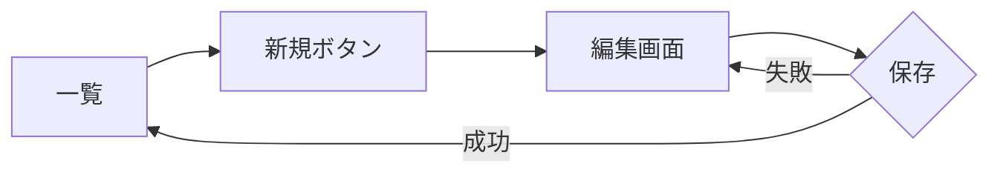
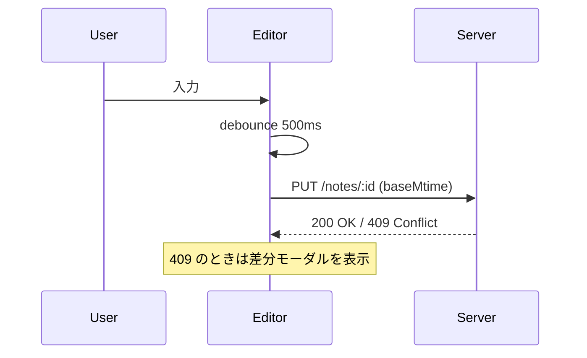

# UI フロー

mermaid の描画確認も兼ねるサンプル。

## メモ作成フロー

```mermaid
flowchart LR
    A[一覧] --> B[新規ボタン]
    B --> C[編集画面]
    C --> D{保存}
    D -->|成功| A
    D -->|失敗| C
```

## メモ編集の保存シーケンス

```mermaid
sequenceDiagram
    participant U as User
    participant E as Editor
    participant S as Server
    U->>E: 入力
    E->>E: debounce 500ms
    E->>S: PUT /notes/:id (baseMtime)
    S-->>E: 200 OK / 409 Conflict
    Note over E: 409 のときは差分モーダルを表示
```
